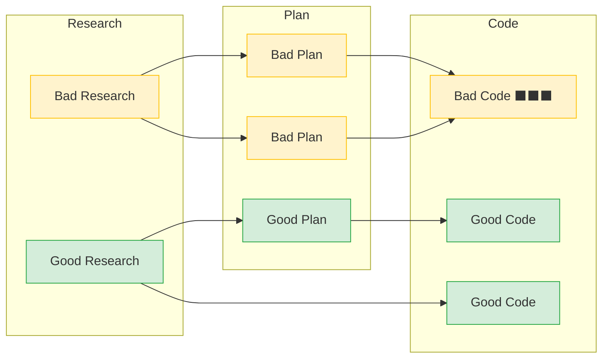
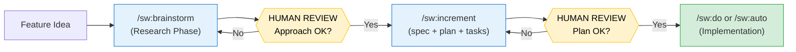

# Why SpecWeave?

**AI changed how we write code. SpecWeave changes how we ship products.**

Every AI coding tool generates code fast. But generating code was never the hard part. The hard part is: **what happens after the chat ends?**

---

## The Problem Everyone Has

You open Claude Code (or ChatGPT, or Copilot). You describe a feature. AI generates code. It works. You move on.

Two weeks later:

- *"Why did we use JWT instead of sessions?"* - Nobody remembers.
- *"What were the acceptance criteria?"* - Lost in chat history.
- *"How does this auth system work?"* - Ask Claude again and hope you get the same answer.

**This is "vibe coding"** - and it's how 90%+ of developers use AI today.

### The 5 Failure Modes of Vibe Coding

| Failure Mode | What Happens | Real Cost |
|-------------|--------------|-----------|
| **Context Evaporation** | AI conversations end, decisions vanish | Teams repeat conversations. New hires have zero context. |
| **Scattered Code** | Each request produces isolated code with no shared patterns | Technical debt from day 1. Constant refactoring. |
| **No Quality Gates** | Code ships without tests, reviews, or documentation | Bugs in production. Security vulnerabilities. |
| **No Traceability** | Can't trace code back to requirements | "Why does this exist?" becomes unanswerable. |
| **Team Chaos** | Multiple developers generate conflicting implementations | Integration hell. Onboarding takes weeks. |
| **Context Exhaustion** | "Prompt is too long" kills your session mid-work | 10-15 min re-explaining per restart. Same decisions repeated. |

### The Hidden Math

```
Vibe Coding a Feature:
  2 hours building
  4 hours fixing bugs (no upfront design)
  3 hours explaining to teammates (no docs)
  ─────────────────────
  9 hours total

SpecWeave:
  30 min planning (spec + plan + tasks)
  1.5 hours building (guided by spec)
  0 hours explaining (docs already exist)
  ─────────────────────
  2 hours total
```

---

## Industry Validation: "No Vibes Allowed"

SpecWeave's approach isn't theoretical — it reflects an emerging industry consensus. In ["No Vibes Allowed: Solving Hard Problems in Complex Codebases"](https://www.youtube.com/watch?v=rmvDxxNubIg), Dex Horthy (HumanLayer, YC F24) presents the **Research-Plan-Implement (RPI)** methodology — a structured workflow that independently validates SpecWeave's core design:

| RPI Concept | SpecWeave Equivalent |
|-------------|---------------------|
| **Research** — investigate the codebase before touching code | Built-in: PM scans existing docs, ADRs, and project structure before writing anything. Deep Interview mode for complex features. `/sw:brainstorm` for multi-approach exploration |
| **Plan** — detailed markdown specs with file locations and test strategy | `spec.md` + `plan.md` + `tasks.md` — the three-file structure |
| **Implement** — execute the validated plan | `/sw:do` or `/sw:auto` — autonomous execution from the plan |
| **One step at a time** — incremental, focused work units | **Increments** — each feature is a self-contained unit of work |
| **Human reviews the plan, not the code** | You review spec + plan at `ExitPlanMode`, AI handles implementation |
| **"Overkill sometimes"** — scale workflow to match problem complexity | Complexity ceiling: simple features skip brainstorm, complex ones use full RPI with agent teams |

The key insight: **bad plans generate orders of magnitude more problems than bad code.** Errors amplify through each phase — a small mistake in research becomes a bigger mistake in the plan, which becomes an even bigger mistake in code:



**Errors compound at each stage.** A small flaw in research produces a proportionally larger flaw in the plan, which produces an even larger proportion of bad code. This is why human review should concentrate on **specifications** — the highest-leverage checkpoint where misunderstandings are cheapest to correct.

As Sean Grove puts it: **"Specs are the new code."**

### Where Human Review Matters Most

SpecWeave places human review at the **plan level**, not the code level. You review `spec.md` and `plan.md` — the artifacts that matter most — while AI handles implementation. For complex or uncertain features, `/sw:brainstorm` adds a research phase before planning, giving you a second review checkpoint:



SpecWeave takes this further: as long as the spec and plan are solid, and progress is tracked through external tools (GitHub, JIRA, ADO), the implementation follows naturally — one increment at a time.

---

## What SpecWeave Does Differently

SpecWeave wraps every AI coding session in a **spec-driven workflow** that turns conversations into permanent, searchable documentation.

### Skills Are Programs in English

Unlike prompts that you copy-paste, SpecWeave skills are reusable programs — each one controls how AI thinks and acts for a specific domain. 100+ skills ship out of the box. Customize any skill without forking via `skill-memories/`. [Deep dive →](./skills-as-programs)

### You Don't Need Claude Code Expertise

SpecWeave abstracts Claude Code's complexity — hooks, plugins, CLAUDE.md, context management. Install, describe your feature, skills handle the rest. [Learn more →](./no-docs-needed)

### Enterprise Ready from Day One

Compliance audit trails in git. Brownfield codebase analysis. Bidirectional sync with GitHub, JIRA, Azure DevOps. Multi-repo coordination. [Enterprise overview →](/docs/enterprise)

### The Three Files

Every feature produces three files that persist across sessions:

| File | Purpose | Owner |
|------|---------|-------|
| `spec.md` | **WHAT**: User stories, acceptance criteria | PM Agent |
| `plan.md` | **HOW**: Architecture decisions, tech choices | Architect Agent |
| `tasks.md` | **DO**: Implementation tasks with test plans | Developer |

```
.specweave/increments/0001-user-auth/
├── spec.md    ← "What are we building and why?"
├── plan.md    ← "How should we build it?"
└── tasks.md   ← "What's the step-by-step plan?"
```

**6 months later**: Search "OAuth" and find exact decisions, who approved them, and why they were made.

### Autonomous Execution

SpecWeave doesn't just plan - it **executes autonomously for hours**:

```bash
/sw:increment "User authentication"   # Creates spec + plan + tasks
/sw:auto                               # Executes autonomously
```

What happens during `/sw:auto`:
1. Reads the spec and tasks
2. Implements each task in order
3. Runs tests after each task
4. Fixes failures automatically
5. Syncs progress to GitHub/JIRA
6. Moves to next task
7. Repeats until done

You review finished work, not work-in-progress.

### 68+ Specialized AI Agents

SpecWeave isn't one AI assistant - it's a **team of 68+ specialized agents** powered by Claude Opus 4.6:

| Agent | Role | When It Activates |
|-------|------|-------------------|
| **PM** | Requirements, user stories, acceptance criteria | `/sw:increment` |
| **Architect** | System design, ADRs, tech stack decisions | Complex features |
| **QA Lead** | Test strategy, quality gates, validation | `/sw:validate` |
| **Security** | OWASP review, vulnerability detection | Mention "security" |
| **DevOps** | CI/CD, infrastructure, deployment | Infrastructure work |
| **Tech Lead** | Code quality, patterns, refactoring | `/sw:grill` |
| **Frontend** | React/Vue/Angular architecture | Frontend work |
| **Backend** | .NET/Node.js/Python patterns | Backend work |

Agents auto-activate based on context. Mention "security" and security expertise loads. No configuration needed.

---

## SpecWeave vs Alternatives

### vs Raw AI Coding (ChatGPT / Claude / Copilot)

| Dimension | Raw AI Coding | SpecWeave |
|-----------|--------------|-----------|
| **Memory** | Session-only | Permanent specs |
| **Planning** | None (you decide what to ask) | Structured spec + plan + tasks |
| **Quality** | Hope it works | 3-gate validation |
| **Documentation** | None (maybe comments) | Auto-generated living docs |
| **Team collaboration** | Share chat links? | Shared specs + JIRA/GitHub sync |
| **Autonomous work** | Copy-paste one response at a time | Hours of unattended execution |

### vs GitHub SpecKit

SpecKit formalizes spec-driven development. SpecWeave extends it into a full lifecycle:

| Dimension | SpecKit | SpecWeave |
|-----------|---------|-----------|
| **Scope** | One feature at a time | Multi-increment lifecycle |
| **After spec creation** | Manual implementation | Autonomous execution |
| **External tools** | None | GitHub, JIRA, Azure DevOps |
| **Documentation** | Static snapshots | Living docs (auto-update) |
| **Codebase support** | Greenfield | Greenfield + Brownfield |
| **Quality gates** | Developer discipline | Automated 3-gate enforcement |

**In set theory**: SpecKit ⊂ SpecWeave. One SpecKit run = one SpecWeave increment.

[Full comparison](/docs/guides/specweave-vs-speckit)

### vs Manual Spec-Driven Development

You could write specs by hand. SpecWeave automates what's tedious:

- **Auto-generates** spec.md, plan.md, tasks.md from a one-line description
- **Auto-links** tasks to acceptance criteria (bidirectional AC-IDs)
- **Auto-syncs** progress to GitHub Issues, JIRA, Azure DevOps
- **Auto-validates** before closing (tests pass, docs updated, ACs met)
- **Auto-updates** living documentation after every completed task

---

## When SpecWeave Is Overkill

Be honest: SpecWeave isn't for everything.

| Scenario | Use SpecWeave? | Why |
|----------|---------------|-----|
| Quick script / one-off tool | No | Just vibe code it |
| Learning exercise / tutorial | No | Overhead not worth it |
| Throwaway prototype | No | It's throwaway |
| Personal weekend project | Maybe | If you want to learn the workflow |
| **Feature for production app** | **Yes** | Specs prevent bugs and tech debt |
| **Team project** | **Yes** | Specs enable collaboration |
| **Enterprise system** | **Yes** | Compliance, audit trails, traceability |

**Rule of thumb**: If someone else will read your code, or if you'll maintain it for more than a month, use SpecWeave.

---

## Getting Started

```bash
npm install -g specweave
cd your-project
specweave init .
```

Then describe what you want:

```bash
/sw:increment "Add user authentication"
/sw:auto
```

SpecWeave handles the rest.

[Quick Start Guide](/docs/getting-started) | [Academy (16 lessons)](/docs/academy/specweave-essentials/) | [All 100+ Skills](/docs/reference/skills)
