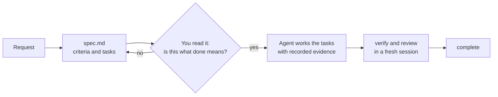

# Why SpecWeave

Generating code was never the hard part. The hard parts come after the chat ends: knowing what "done" meant, proving it, and carrying on when the session, the tool or the subscription runs out.

## Three failures SpecWeave is built for

**Done is whatever the agent says.** Without written acceptance criteria, an agent reports success when the code compiles and its own reading of the request is satisfied. SpecWeave asks for the criteria first, attaches each task to them, and only records a task as done when its test command actually exits 0.

**Decisions evaporate.** Why JWT and not sessions? What did we try that failed? In a chat transcript, nobody will find it. In SpecWeave it is in the spec's Approach, in a ledger note, or in a one-fact file under `.specweave/memory/`, all committed with the code.

**Work is stuck in one tool.** Every coding tool keeps its session private. When you hit a usage limit halfway through a feature, or want a second model's opinion, the next tool starts cold. SpecWeave keeps the state in git and gives you one command to hand off and one to pick up, so Codex can continue what Claude Code started, or a second Claude subscription can continue the first.

## Review the plan, not every line

Errors compound. A misunderstanding in the request becomes a wrong design, which becomes a lot of wrong code. The cheapest place to catch it is the spec: a page you can read in a minute before anything is written.

This is the same idea as Research, Plan, Implement, described by Dex Horthy in ["No Vibes Allowed"](https://www.youtube.com/watch?v=rmvDxxNubIg): put human attention on the plan, where a correction costs least.

## Why files and not a service

A service would need every tool to integrate with it. Files in git need nothing: every coding agent can read a markdown file and run a command. That is why SpecWeave works the same in Claude Code, Codex, Grok Build, Cursor, Copilot, Gemini CLI and OpenCode, in a cloud thread and on your laptop, and under any account. It is also why the record can be audited: the ledger is append-only and lives in the same history as the code it describes.

3.0 took this further by cutting what the agent has to read. An increment is one short file, the instruction file is about 760 tokens, and the CLI hands the agent exactly one task and its criteria at a time. See [What changed in 3.0](/docs/guides/specweave-3).

## When it is more than you need

| Situation | Use an increment? |
|---|---|
| A one-line fix or a quick script | No. Just ask your agent. |
| A throwaway prototype | No. |
| A feature that will ship to users | Yes. Criteria prevent "done but wrong". |
| Work that will span sessions, tools or accounts | Yes. This is what handoff and pickup are for. |
| Several agents or people in one codebase | Yes. Claims and one increment per branch keep them apart. |
| Work that needs an audit trail | Yes. The ledger records who did what, with evidence. |

A rule of thumb: if someone else will continue the work, including you next week in a different tool, write the spec.

## Next

- [Quick start](/docs/getting-started)
- [How it works](/docs/overview/how-it-works)
- [SpecWeave vs Spec Kit](/docs/guides/specweave-vs-speckit)
