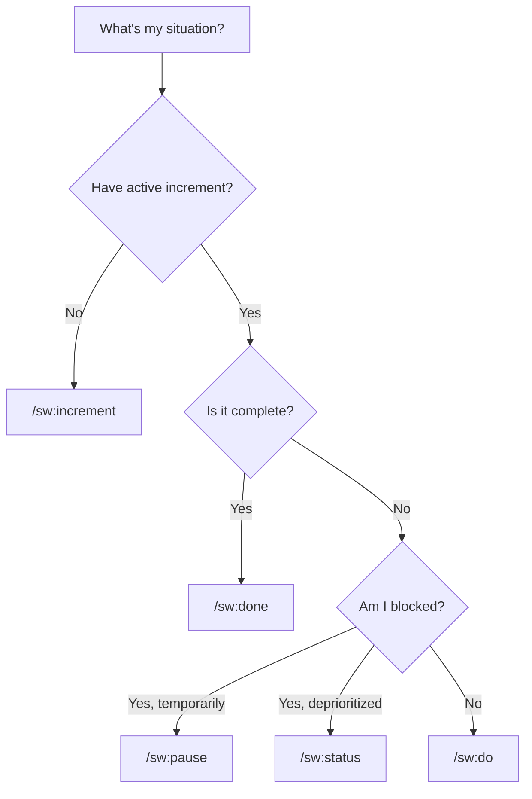
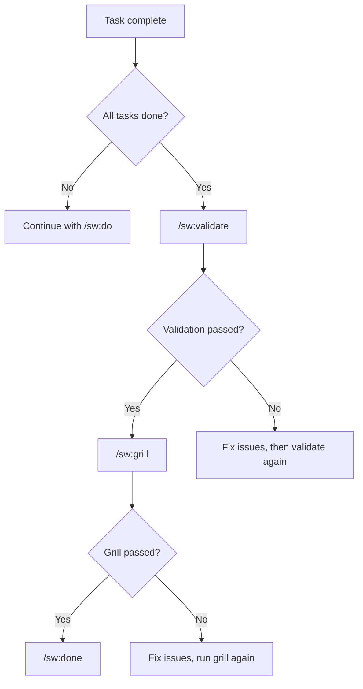

# SpecWeave Command Decision Tree

**What do you want to do?** Just say it in plain English, use a slash command, or type a keyword. All three work.

---

## Quick Reference Card

| I want to... | Natural Language | Claude Code | Other AI |
|--------------|-----------------|-------------|----------|
| Start new feature | "Let's build X" | `/sw:increment "X"` | `increment "X"` |
| Implement current feature | "Start implementing" | `/sw:do` | `do` |
| See what's in progress | "What's the status?" | `/sw:progress` | `progress` |
| Code review before close | "Review my work" | `/sw:grill 0001` | `grill 0001` |
| Complete an increment | "We're done" | `/sw:done 0001` | `done 0001` |
| Pause for other work | "Put this on hold" | `/sw:pause 0001` | `pause 0001` |
| Resume paused work | "Continue where we left off" | `/sw:resume 0001` | `resume 0001` |
| Validate before closing | "Check quality" | `/sw:validate 0001` | `validate 0001` |
| Sync to GitHub/JIRA | "Sync progress" | `/sw:sync-progress` | `sync-progress` |
| Save and push changes | "Save my work" | `/sw:save` | `save` |

---

## Decision Flowcharts

### "What should I do next?"



### "I finished my task"



---

## By Scenario

### Starting Work

| Scenario | Natural Language | Claude Code | Other AI |
|----------|-----------------|-------------|----------|
| New feature | "Build X" | `/sw:increment "X"` | `increment "X"` |
| New bug fix | "Fix the login bug" | `/sw:increment "fix: bug"` | `increment "fix: bug"` |
| New experiment | "Let's experiment with X" | `/sw:increment "experiment: X"` | `increment "experiment: X"` |
| Resume from backlog | "Resume where we left off" | `/sw:resume 0001` | `resume 0001` |

### During Implementation

| Scenario | Natural Language | Claude Code | Other AI |
|----------|-----------------|-------------|----------|
| Implement tasks | "Start implementing" | `/sw:do` | `do` |
| Check progress | "How far along?" | `/sw:progress` | `progress` |
| View current status | "List all increments" | `/sw:status` | `status` |
| Run quality check | "Assess quality" | `/sw:qa` | `qa` |

### Pausing Work

| Scenario | Natural Language | Claude Code | Other AI |
|----------|-----------------|-------------|----------|
| Temporarily blocked | "Pause this" | `/sw:pause 0001` | `pause 0001` |
| Feature canceled | "Abandon this" | `/sw:abandon 0001` | `abandon 0001` |

### Completing Work

| Scenario | Natural Language | Claude Code | Other AI |
|----------|-----------------|-------------|----------|
| Validate before closing | "Check quality" | `/sw:validate 0001` | `validate 0001` |
| Code review before close | "Review my work" | `/sw:grill 0001` | `grill 0001` |
| Close with PM review | "We're done" | `/sw:done 0001` | `done 0001` |
| Move to next increment | "What's next?" | `/sw:next` | `next` |

### Syncing & Saving

| Scenario | Natural Language | Claude Code | Other AI |
|----------|-----------------|-------------|----------|
| Sync to external tools | "Sync progress" | `/sw:sync-progress` | `sync-progress` |
| Update living docs | "Update the docs" | `/sw:sync-docs` | `sync-docs` |
| Save and push to git | "Save my work" | `/sw:save` | `save` |

---

## Command Categories

### Lifecycle Commands

```
Start     →  /sw:increment
Implement →  /sw:do
Validate  →  /sw:validate
Review    →  /sw:grill (mandatory!)
Complete  →  /sw:done
```

### Status Management

```
Pause      →  /sw:pause    (temporary block)
Backlog    →  /sw:status  (deprioritized)
Resume     →  /sw:resume   (continue work)
Abandon    →  /sw:abandon  (cancel)
Reopen     →  /sw:resume   (needs more work)
```

### Visibility

```
Progress   →  /sw:progress   (task completion)
Status     →  /sw:status     (all increments)
```

### Synchronization

```
Sync All       →  /sw:sync-progress   (tasks → docs → external)
Sync Docs      →  /sw:sync-docs       (living docs)
Sync Tasks     →  /sw:progress-sync      (external → tasks.md)
```

### Quality

```
Validate   →  /sw:validate   (rule-based)
QA         →  /sw:qa         (AI spec assessment)
Grill      →  /sw:grill      (code review - MANDATORY before close!)
Judge-LLM  →  /sw:judge-llm  (ultrathink code validation)
```

---

## Common Workflows

### Basic Feature Workflow

```bash
# 1. Plan the feature
/sw:increment "User authentication"

# 2. Implement it
/sw:do

# 3. Check progress periodically
/sw:progress

# 4. Validate when tasks complete
/sw:validate 0001

# 5. Code review (mandatory!)
/sw:grill 0001

# 6. Close when ready
/sw:done 0001
```

### Handling Interruptions

```bash
# Working on feature A
/sw:do

# Urgent bug comes in
/sw:pause 0001

# Fix the bug
/sw:increment "fix: critical login bug"
/sw:do
/sw:done 0002

# Resume feature A
/sw:resume 0001
/sw:do
```

### Team Handoff

```bash
# Before handoff: validate and sync
/sw:validate 0001
/sw:sync-progress

# Handoff to teammate with clean state
# They can see progress in GitHub/JIRA
```

### End of Day

```bash
# Sync all progress
/sw:sync-progress

# Save and push
/sw:save
```

---

## When Things Go Wrong

### Increment Needs More Work (Closed Too Early)

```bash
/sw:resume 0001
# Continue work
/sw:do
/sw:done 0001
```

### Wrong Increment Active

```bash
# Check what's active
/sw:status

# Switch to correct one
/sw:pause 0001    # Pause wrong one
/sw:resume 0002   # Resume correct one
```

### Sync Failed

```bash
# Check sync status
/sw-github:status

# Force sync
/sw:sync-progress
```

### Validation Fails

```bash
# See what failed
/sw:validate 0001

# Common issues:
# - Tasks not complete → mark tasks done
# - Tests not passing → fix tests
# - Docs not updated → run /sw:sync-docs
```

---

## Platform-Specific Commands

### GitHub

```bash
/sw-github:sync       # Sync increment
/sw-github:create     # Create issue
/sw-github:close      # Close issue
/sw-github:status     # Check status
```

### JIRA

```bash
/sw-jira:sync         # Sync increment
/sw-jira:import-projects        # Import JIRA projects
```

### Azure DevOps

```bash
/sw-ado:sync           # Sync increment
/sw-ado:create         # Create work item
/sw-ado:status         # Check status
```

---

## Command Cheat Sheet

### Most Used (Daily)

| Natural Language | Claude Code | Other AI | Purpose |
|-----------------|-------------|----------|---------|
| "Let's build X" | `/sw:increment` | `increment` | Start new work |
| "Start implementing" | `/sw:do` | `do` | Implement tasks |
| "What's the status?" | `/sw:progress` | `progress` | Check completion |
| "We're done" | `/sw:done` | `done` | Complete increment |
| "Save my work" | `/sw:save` | `save` | Commit and push |

### Frequent (Weekly)

| Natural Language | Claude Code | Other AI | Purpose |
|-----------------|-------------|----------|---------|
| "Pause this" | `/sw:pause` | `pause` | Temporarily stop |
| "Continue working" | `/sw:resume` | `resume` | Continue paused |
| "Check quality" | `/sw:validate` | `validate` | Pre-close check |
| "Sync progress" | `/sw:sync-progress` | `sync-progress` | Sync external tools |

### Occasional (As Needed)

| Natural Language | Claude Code | Other AI | Purpose |
|-----------------|-------------|----------|---------|
| "List all increments" | `/sw:status` | `status` | View all work |
| "Cancel this" | `/sw:abandon` | `abandon` | Cancel work |
| "Assess quality" | `/sw:qa` | `qa` | Quality assessment |

---

## Tips

1. **Use natural language first** -- just describe what you want and SpecWeave picks the right skill
2. **Start with planning** -- say "let's build X" or `/sw:increment` before coding
3. **Check progress often** -- ask "what's the status?" or `/sw:progress`
4. **Validate before closing** -- "check quality" or `/sw:validate` catches issues
5. **Always grill before done** -- "review my work" or `/sw:grill` is mandatory for closure
6. **Sync at end of day** -- "sync progress" or `/sw:sync-progress` keeps everyone informed

---

## Related

- [Commands Overview](/docs/commands/overview)
- [Workflow Guide](/docs/workflows/overview)
- [Troubleshooting](/docs/guides/troubleshooting/)
