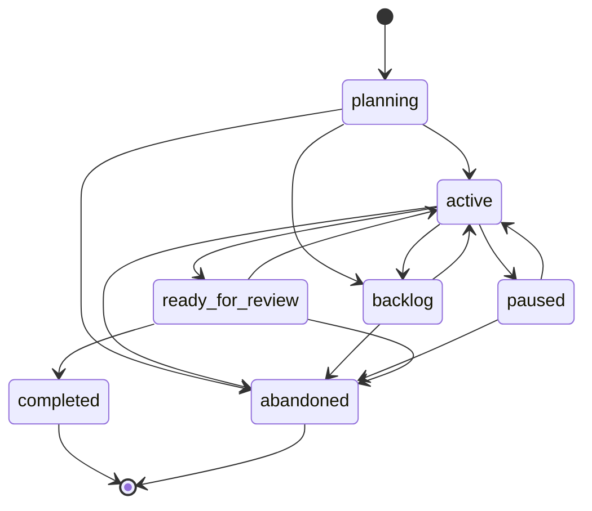

# Configuration Reference

SpecWeave uses three configuration surfaces: **project config** (`config.json`), **increment metadata** (`metadata.json`), and **environment variables**. This page documents every property, its type, default value, and purpose.

## Config File Locations

| File | Location | Scope |
|------|----------|-------|
| Project config | `.specweave/config.json` | Per-project settings |
| Increment metadata | `.specweave/increments/{id}/metadata.json` | Per-increment state |

SpecWeave creates `config.json` during `specweave init`. Edit it directly or use CLI commands that modify it on your behalf.

---

## Quick Reference: Disableable Features

The most common configuration need is turning features on or off. This table shows every disableable feature at a glance.

| Feature | Config Path | Value to Disable | Default |
|---------|-------------|-----------------|---------|
| Living docs (copy-based sync) | `livingDocs.copyBasedSync.enabled` | `false` | `true` |
| Living docs (three-layer sync) | `livingDocs.threeLayerSync.enabled` | `false` | `true` |
| Living docs auto-generation | `livingDocs.copyBasedSync.autoGenerate` | `false` | `true` |
| TDD enforcement | `testing.tddEnforcement` | `"off"` | _(not set)_ |
| Deep interview mode | `planning.deepInterview.enabled` | `false` | `false` |
| Plugin auto-loading | `pluginAutoLoad.enabled` | `false` | `true` |
| Reflection / skill learning | `reflect.enabled` | `false` | `true` |
| Grill quality gate | `grill.required` | `false` | `true` |
| External sync | `sync.enabled` | `false` | `false` |
| Auto-sync on completion | `sync.autoSync` | `false` | `false` |
| Auto-create external issues | `hooks.post_increment_planning.auto_create_github_issue` | `false` | `true` |
| Close external issue on done | `hooks.post_increment_done.close_github_issue` | `false` | `true` |
| Living docs sync on done | `hooks.post_increment_done.sync_living_docs` | `false` | `true` |
| Increment assist | `incrementAssist.enabled` | `false` | `true` |
| Increment assist (mandatory) | `incrementAssist.mandatory` | `false` | `true` |
| Status line | `statusLine.enabled` | `false` | `true` |
| Auto-archive | `archiving.autoArchive` | `false` | `false` |
| API docs generation | `apiDocs.enabled` | `false` | `false` |
| Translation | `translation.enabled` | `false` | `false` |
| Context budget auto-adapt | `contextBudget.autoAdapt` | `false` | `true` |
| CI/CD auto-fix | `cicd.autoFix.enabled` | `false` | `true` |
| Deduplication | `deduplication.enabled` | `false` | `true` |
| All hooks at once | env: `SPECWEAVE_DISABLE_HOOKS` | `1` | _(not set)_ |

:::tip Living Docs Trade-off
Living docs generate Architecture Decision Records (ADRs), API specs, and project knowledge that LLMs use to make better decisions in future increments. Disabling them speeds up increment closure but removes this accumulated context. Consider keeping them enabled if you use AI-assisted development across multiple sessions.
:::

---

## config.json Reference

### Core

| Property | Type | Default | Description |
|----------|------|---------|-------------|
| `version` | `string` | `"2.0"` | Config schema version. Used for automatic migrations |
| `language` | `string` | `"en"` | Display language. Values: `en`, `ru`, `es`, `zh`, `de`, `fr`, `ja`, `ko`, `pt` |

```json
{
  "version": "2.0",
  "language": "en"
}
```

### project

Project metadata used for display and sync routing.

| Property | Type | Default | Description |
|----------|------|---------|-------------|
| `name` | `string` | — | Project display name |
| `version` | `string` | — | Project version |
| `description` | `string` | — | Project description |
| `techStack` | `string[]` | — | Technology keywords (e.g., `["typescript", "react"]`) |
| `team` | `string` | — | Team identifier |

```json
{
  "project": {
    "name": "my-app",
    "version": "1.0.0",
    "techStack": ["typescript", "nextjs", "postgresql"]
  }
}
```

### adapters

Controls which LLM adapter SpecWeave uses for instruction generation.

| Property | Type | Default | Description |
|----------|------|---------|-------------|
| `default` | `string` | `"claude"` | Default adapter. Values: `claude`, `cursor`, `generic` |

```json
{
  "adapters": { "default": "claude" }
}
```

### testing

Testing mode, coverage targets, and TDD enforcement.

| Property | Type | Default | Description |
|----------|------|---------|-------------|
| `defaultTestMode` | `string` | `"TDD"` | Test strategy. Values: `TDD`, `test-after`, `manual`, `none` |
| `defaultCoverageTarget` | `number` | `90` | Default coverage percentage (0-100) |
| `coverageTargets.unit` | `number` | `95` | Unit test coverage target |
| `coverageTargets.integration` | `number` | `90` | Integration test coverage target |
| `coverageTargets.e2e` | `number` | `100` | E2E test coverage target |
| `tddEnforcement` | `string` | _(not set)_ | TDD enforcement level. Values: `strict`, `warn`, `off` |
| `playwright.preferCli` | `boolean` | `true` | Use Playwright CLI for E2E tests |
| `playwright.cliFlags` | `string[]` | — | Additional Playwright CLI flags |

```json
{
  "testing": {
    "defaultTestMode": "TDD",
    "coverageTargets": { "unit": 95, "integration": 90, "e2e": 100 },
    "tddEnforcement": "strict",
    "playwright": { "preferCli": true }
  }
}
```

### grill

Quality gate requiring a grill report before increment closure.

| Property | Type | Default | Description |
|----------|------|---------|-------------|
| `required` | `boolean` | `true` | Require grill report before `/sw:done` |

```json
{
  "grill": { "required": true }
}
```

### limits

Work-in-progress limits and staleness detection.

| Property | Type | Default | Description |
|----------|------|---------|-------------|
| `maxActiveIncrements` | `number` | `3` | Recommended max concurrent active increments |
| `hardCap` | `number` | `5` | Absolute maximum active increments |
| `allowEmergencyInterrupt` | `boolean` | `true` | Allow hotfix/bug to bypass WIP limits |
| `typeBehaviors.canInterrupt` | `string[]` | `["hotfix", "bug"]` | Increment types that can bypass limits |
| `typeBehaviors.autoAbandonDays.experiment` | `number` | `14` | Days before auto-abandoning experiments |
| `staleness.paused` | `number` | `7` | Days before marking paused increments as stale |
| `staleness.active` | `number` | `30` | Days before marking active increments as stale |

```json
{
  "limits": {
    "maxActiveIncrements": 3,
    "hardCap": 5,
    "allowEmergencyInterrupt": true,
    "staleness": { "paused": 7, "active": 30 }
  }
}
```

### planning

Controls the deep interview feature during increment planning.

| Property | Type | Default | Description |
|----------|------|---------|-------------|
| `deepInterview.enabled` | `boolean` | `false` | Enable deep interview during `/sw:increment` |
| `deepInterview.enforcement` | `string` | — | Enforcement level. Values: `strict`, `warn`, `off` |
| `deepInterview.minQuestions` | `number` | `5` | Minimum questions to ask |
| `deepInterview.categories` | `string[]` | _(all 6)_ | Question categories: `architecture`, `integrations`, `ui-ux`, `performance`, `security`, `edge-cases` |

```json
{
  "planning": {
    "deepInterview": {
      "enabled": true,
      "enforcement": "strict",
      "minQuestions": 5
    }
  }
}
```

### incrementAssist

Controls whether SpecWeave proactively suggests creating or reopening increments.

| Property | Type | Default | Description |
|----------|------|---------|-------------|
| `enabled` | `boolean` | `true` | Enable increment assist |
| `suggestNewIncrement` | `boolean` | `true` | Suggest creating new increments |
| `suggestReopen` | `boolean` | `true` | Suggest reopening closed increments |
| `confidenceThreshold` | `number` | `0.7` | Confidence required to trigger suggestion (0-1) |
| `mandatory` | `boolean` | `true` | Make increment creation mandatory for implementation work |

```json
{
  "incrementAssist": {
    "enabled": true,
    "mandatory": false
  }
}
```

### livingDocs

Controls automatic living documentation synchronization.

| Property | Type | Default | Description |
|----------|------|---------|-------------|
| `copyBasedSync.enabled` | `boolean` | `true` | Enable copy-based sync (spec copies to docs) |
| `copyBasedSync.autoGenerate` | `boolean` | `true` | Auto-generate doc copies on increment done |
| `threeLayerSync.enabled` | `boolean` | `true` | Enable three-layer sync (specs, ADRs, API docs) |
| `threeLayerSync.autoSync` | `boolean` | `true` | Auto-sync on changes |

```json
{
  "livingDocs": {
    "copyBasedSync": { "enabled": true, "autoGenerate": true },
    "threeLayerSync": { "enabled": true, "autoSync": true }
  }
}
```

:::info Why Living Docs Matter
Living docs build up project knowledge over time — ADRs, API specifications, and increment history. LLMs use this context to make better architectural decisions in future increments. Disabling living docs removes this feedback loop but makes increment closure faster.
:::

### documentation

Controls documentation preview and directory scanning.

| Property | Type | Default | Description |
|----------|------|---------|-------------|
| `directories` | `string[]` | `[".specweave/docs"]` | Directories to scan for documentation |
| `publicSitePath` | `string` | — | Path to public documentation site |
| `preview.enabled` | `boolean` | `false` | Enable documentation preview server |
| `preview.autoInstall` | `boolean` | — | Auto-install preview dependencies |
| `preview.port` | `number` | `3015` | Preview server port |
| `preview.openBrowser` | `boolean` | — | Auto-open browser on preview start |
| `preview.theme` | `string` | — | Preview theme name |
| `preview.excludeFolders` | `string[]` | — | Folders to exclude from preview |

```json
{
  "documentation": {
    "directories": [".specweave/docs"],
    "preview": { "enabled": true, "port": 3015 }
  }
}
```

### apiDocs

API documentation auto-generation from code.

| Property | Type | Default | Description |
|----------|------|---------|-------------|
| `enabled` | `boolean` | `false` | Enable API docs generation |
| `openApiPath` | `string` | `"openapi.yaml"` | Path to OpenAPI spec file |
| `autoGenerateOpenApi` | `boolean` | `true` | Auto-generate OpenAPI spec from code |
| `generatePostman` | `boolean` | `true` | Generate Postman collection |
| `postmanPath` | `string` | `"postman-collection.json"` | Postman collection output path |
| `postmanEnvPath` | `string` | `"postman-environment.json"` | Postman environment output path |
| `generateOn` | `string` | `"on-increment-done"` | When to generate. Values: `on-increment-done`, `on-api-change`, `manual` |
| `watchPatterns` | `string[]` | `["**/routes/**", ...]` | File patterns to watch for API changes |
| `baseUrl` | `string` | `"http://localhost:3000"` | API base URL |

```json
{
  "apiDocs": {
    "enabled": true,
    "generateOn": "on-api-change",
    "watchPatterns": ["**/routes/**", "**/controllers/**"]
  }
}
```

### sync

External tool synchronization (GitHub, JIRA, Azure DevOps).

| Property | Type | Default | Description |
|----------|------|---------|-------------|
| `enabled` | `boolean` | `false` | Master sync switch |
| `direction` | `string` | `"bidirectional"` | Sync direction. Values: `import`, `export`, `bidirectional` |
| `autoSync` | `boolean` | `false` | Auto-sync on increment changes |
| `includeStatus` | `boolean` | `true` | Sync status fields |
| `autoApplyLabels` | `boolean` | `true` | Auto-apply labels during sync |
| `provider` | `string` | — | Exclusive provider: `jira`, `github`, `ado` |
| `defaultProfile` | `string` | — | Fallback sync profile name |
| `autoCreateOnIncrement` | `boolean` | — | Auto-create external issues on increment creation |
| `settings.canUpsertInternalItems` | `boolean` | — | Allow creating internal items from external |
| `settings.canUpdateExternalItems` | `boolean` | — | Allow updating external items |
| `settings.canUpdateStatus` | `boolean` | — | Allow status sync |
| `settings.autoSyncOnCompletion` | `boolean` | — | Auto-sync when increment completes |
| `github.enabled` | `boolean` | — | Enable GitHub sync |
| `github.owner` | `string` | — | GitHub org/user |
| `github.repo` | `string` | — | GitHub repository name |
| `jira.enabled` | `boolean` | — | Enable JIRA sync |
| `jira.domain` | `string` | — | JIRA instance domain |
| `jira.projectKey` | `string` | — | JIRA project key |
| `ado.enabled` | `boolean` | — | Enable Azure DevOps sync |
| `ado.organization` | `string` | — | ADO organization |
| `ado.project` | `string` | — | ADO project |
| `profiles` | `object` | — | Named sync profiles (keyed by profile ID) |

```json
{
  "sync": {
    "enabled": true,
    "direction": "bidirectional",
    "autoSync": true,
    "github": { "enabled": true, "owner": "my-org", "repo": "my-app" }
  }
}
```

:::tip Use `/sw:sync-setup` to configure sync interactively instead of editing config.json manually.
:::

### hooks

Lifecycle hooks that trigger actions on increment events.

| Property | Type | Default | Description |
|----------|------|---------|-------------|
| `post_task_completion.sync_tasks_md` | `boolean` | `true` | Sync tasks.md after task completion |
| `post_task_completion.external_tracker_sync` | `boolean` | `true` | Sync to external tracker after task completion |
| `post_increment_planning.auto_create_github_issue` | `boolean` | `true` | Auto-create external issue after planning |
| `post_increment_planning.sync_living_docs` | `boolean` | `true` | Sync living docs after planning |
| `post_increment_done.sync_living_docs` | `boolean` | `true` | Sync living docs on increment done |
| `post_increment_done.sync_to_github_project` | `boolean` | `true` | Sync to GitHub project on done |
| `post_increment_done.close_github_issue` | `boolean` | `true` | Close GitHub issue on done |
| `post_increment_done.close_jira_issue` | `boolean` | — | Close JIRA issue on done |
| `post_increment_done.close_ado_work_item` | `boolean` | — | Close ADO work item on done |

```json
{
  "hooks": {
    "post_task_completion": { "sync_tasks_md": true, "external_tracker_sync": true },
    "post_increment_planning": { "auto_create_github_issue": false },
    "post_increment_done": { "sync_living_docs": true, "close_github_issue": true }
  }
}
```

### issueTracker

Issue tracking system provider configuration.

| Property | Type | Default | Description |
|----------|------|---------|-------------|
| `provider` | `string` | `"none"` | Provider. Values: `none`, `jira`, `github`, `ado` |
| `domain` | `string` | — | JIRA domain (JIRA only) |
| `instanceType` | `string` | — | JIRA instance type. Values: `cloud`, `server` |
| `strategy` | `string` | — | JIRA organization strategy. Values: `single-project`, `project-per-team`, `component-based`, `board-based` |
| `projects` | `array` | — | JIRA project configurations |

```json
{
  "issueTracker": {
    "provider": "jira",
    "domain": "myteam.atlassian.net",
    "strategy": "single-project",
    "projects": [{ "key": "MYAPP", "name": "My Application" }]
  }
}
```

### repository

Repository provider and Git configuration.

| Property | Type | Default | Description |
|----------|------|---------|-------------|
| `provider` | `string` | `"local"` | Provider. Values: `local`, `github`, `bitbucket`, `ado`, `gitlab`, `generic` |
| `organization` | `string` | — | Organization or team identifier |
| `gitUrlFormat` | `string` | — | Git URL format. Values: `ssh`, `https` |
| `repos` | `array` | — | Repository configurations |

```json
{
  "repository": {
    "provider": "github",
    "organization": "my-org",
    "gitUrlFormat": "ssh"
  }
}
```

### cicd

CI/CD pipeline and Git branching configuration.

| Property | Type | Default | Description |
|----------|------|---------|-------------|
| `pushStrategy` | `string` | `"direct"` | Push strategy. Values: `direct`, `pr-based` |
| `git.branchPrefix` | `string` | `"sw/"` | Feature branch prefix |
| `git.targetBranch` | `string` | `"main"` | PR target branch |
| `git.deleteOnMerge` | `boolean` | `true` | Delete branch after merge |
| `git.includeExternalKey` | `boolean` | `false` | Include JIRA/ADO key in branch name |
| `release.strategy` | `string` | — | Release strategy. Values: `trunk`, `gitflow`, `env-promotion` |
| `release.environments` | `array` | — | Environment configs (for `env-promotion`) |
| `autoFix.enabled` | `boolean` | `true` | Enable auto-fix on CI failure |
| `autoFix.maxRetries` | `number` | `1` | Max retry attempts |
| `autoFix.allowedBranches` | `string[]` | `["develop", "main"]` | Branches where auto-fix is allowed |
| `monitoring.pollInterval` | `number` | — | CI poll interval (ms) |
| `monitoring.autoNotify` | `boolean` | — | Auto-notify on CI completion |

```json
{
  "cicd": {
    "pushStrategy": "pr-based",
    "git": { "branchPrefix": "sw/", "targetBranch": "develop" },
    "autoFix": { "enabled": true, "maxRetries": 2 }
  }
}
```

### auto

Autonomous execution mode (`/sw:auto`) configuration.

| Property | Type | Default | Description |
|----------|------|---------|-------------|
| `enabled` | `boolean` | — | Enable auto mode |
| `maxRetries` | `number` | `20` | Max retries before escalating |
| `maxTurns` | `number` | `50` | Max total turns in auto session |
| `maxIterations` | `number` | `2500` | Safety limit for iterations |
| `maxHours` | `number` | — | Max session hours |
| `requireTests` | `boolean` | `false` | Require tests pass before closure |
| `requireValidation` | `boolean` | `true` | Require `/sw:validate` |
| `requireJudgeLLM` | `boolean` | `false` | Require `/sw:judge-llm` |
| `skipQualityGates` | `boolean` | `false` | Skip all quality gates |
| `testCommand` | `string` | — | Custom test command |
| `coverageThreshold` | `number` | — | Coverage requirement (%) |
| `enforceTestFirst` | `boolean` | — | TDD enforcement in auto mode |

```json
{
  "auto": {
    "enabled": true,
    "maxRetries": 20,
    "requireTests": true,
    "requireValidation": true
  }
}
```

### reflect

Controls automatic skill learning from session corrections.

| Property | Type | Default | Description |
|----------|------|---------|-------------|
| `enabled` | `boolean` | `true` | Enable reflection and skill memory extraction |
| `model` | `string` | `"haiku"` | Model for extraction. Values: `haiku`, `sonnet`, `opus` |
| `maxLearningsPerSession` | `number` | `3` | Max learnings saved per session |

```json
{
  "reflect": { "enabled": false }
}
```

### contextBudget

Controls how much context SpecWeave injects into LLM prompts.

| Property | Type | Default | Description |
|----------|------|---------|-------------|
| `level` | `string` | `"full"` | Budget level. Values: `full` (2500 chars), `compact`, `minimal`, `off` |
| `autoAdapt` | `boolean` | `true` | Auto-reduce when context pressure detected |

```json
{
  "contextBudget": { "level": "compact", "autoAdapt": true }
}
```

### skillGen

Automatic skill generation from detected project patterns.

| Property | Type | Default | Description |
|----------|------|---------|-------------|
| `detection` | `string` | `"on-close"` | When to detect patterns. Values: `on-close`, `off` |
| `suggest` | `boolean` | `true` | Show skill suggestions on increment closure |
| `minSignalCount` | `number` | `3` | Min pattern occurrences to qualify |
| `maxSignals` | `number` | `100` | Max signals to retain |
| `declinedSuggestions` | `string[]` | `[]` | Permanently excluded patterns |

```json
{
  "skillGen": { "detection": "off" }
}
```

### translation

Multi-language translation configuration.

| Property | Type | Default | Description |
|----------|------|---------|-------------|
| `enabled` | `boolean` | `false` | Enable auto-translation |
| `languages` | `string[]` | `["en"]` | Enabled languages (always includes `en`) |
| `primary` | `string` | `"en"` | Primary output language |
| `method` | `string` | `"auto"` | Trigger method. Values: `auto`, `manual`, `none` |
| `preserveFrameworkTerms` | `boolean` | `true` | Keep SpecWeave terms in English |
| `scope.incrementSpecs` | `boolean` | `false` | Translate increment specs |
| `scope.livingDocs` | `boolean` | `false` | Translate living docs |
| `scope.externalSync` | `boolean` | `false` | Translate external sync content |
| `keepEnglishOriginals` | `boolean` | `false` | Keep `.en.md` originals alongside translations |

```json
{
  "translation": {
    "enabled": true,
    "languages": ["en", "de"],
    "primary": "de"
  }
}
```

### umbrella

Multi-repository umbrella configuration.

| Property | Type | Default | Description |
|----------|------|---------|-------------|
| `enabled` | `boolean` | `false` | Enable umbrella mode |
| `projectName` | `string` | — | Umbrella project display name |
| `parentRepo` | `string` | — | Parent repo name |
| `childRepos` | `array` | — | Child repository configurations |
| `childRepos[].id` | `string` | — | Repo identifier |
| `childRepos[].path` | `string` | — | Relative path to repo |
| `childRepos[].name` | `string` | — | Display name |
| `childRepos[].prefix` | `string` | — | User story prefix (e.g., `FE`, `BE`) |
| `childRepos[].techStack` | `string[]` | — | Tech keywords for routing |
| `childRepos[].role` | `string` | — | Repo role: `frontend`, `backend`, `mobile`, `infra`, `shared`, `other` |
| `childRepos[].disabled` | `boolean` | — | Disable this repo |
| `childRepos[].disabledReason` | `string` | — | Why disabled |
| `storyRouting.enabled` | `boolean` | — | Enable auto-routing of stories to repos |
| `storyRouting.defaultRepo` | `string` | — | Default repo for cross-cutting stories |

```json
{
  "umbrella": {
    "enabled": true,
    "projectName": "my-platform",
    "childRepos": [
      { "id": "frontend", "path": "repositories/my-org/frontend", "prefix": "FE", "role": "frontend" },
      { "id": "backend", "path": "repositories/my-org/backend", "prefix": "BE", "role": "backend" }
    ]
  }
}
```

### archiving

Increment archiving and cleanup rules.

| Property | Type | Default | Description |
|----------|------|---------|-------------|
| `keepLast` | `number` | `5` | Keep last N completed increments |
| `autoArchive` | `boolean` | `false` | Auto-archive when threshold reached |
| `autoArchiveThreshold` | `number` | `10` | Archive when count exceeds this |
| `archiveAfterDays` | `number` | `60` | Archive after N days of inactivity |
| `preserveActive` | `boolean` | `true` | Never archive active increments |
| `archiveCompleted` | `boolean` | `false` | Archive completed increments |
| `archivePatterns` | `string[]` | `[]` | Glob patterns to auto-archive |
| `preserveList` | `string[]` | `[]` | Increment IDs to never archive |

```json
{
  "archiving": {
    "autoArchive": true,
    "archiveAfterDays": 30,
    "keepLast": 10
  }
}
```

### deduplication

Prevents duplicate command execution within a time window.

| Property | Type | Default | Description |
|----------|------|---------|-------------|
| `enabled` | `boolean` | `true` | Enable command deduplication |
| `windowMs` | `number` | `1000` | Deduplication window (milliseconds) |
| `maxCacheSize` | `number` | `1000` | Max cached command entries |
| `debug` | `boolean` | `false` | Enable debug logging |
| `cleanupIntervalMs` | `number` | `60000` | Cache cleanup interval (ms) |

```json
{
  "deduplication": { "enabled": true, "windowMs": 2000 }
}
```

### statusLine

Controls the status line displayed in Claude Code.

| Property | Type | Default | Description |
|----------|------|---------|-------------|
| `enabled` | `boolean` | `true` | Enable status line |
| `maxCacheAge` | `number` | `30000` | Max cache age before refresh (ms) |
| `progressBarWidth` | `number` | `8` | Progress bar width (characters) |
| `maxNameLength` | `number` | `30` | Max increment name display length |

```json
{
  "statusLine": { "enabled": false }
}
```

### pluginAutoLoad

Controls automatic detection and loading of plugins.

| Property | Type | Default | Description |
|----------|------|---------|-------------|
| `enabled` | `boolean` | `true` | Enable plugin auto-loading |
| `suggestOnly` | `boolean` | `true` | Only suggest plugins, don't auto-install |

```json
{
  "pluginAutoLoad": { "enabled": false }
}
```

### lsp

Language Server Protocol integration for code intelligence.

| Property | Type | Default | Description |
|----------|------|---------|-------------|
| `enabled` | `boolean` | `true` | Enable LSP support |
| `autoInstallPlugins` | `boolean` | `true` | Auto-install LSP plugins |
| `marketplace` | `string` | `"boostvolt/claude-code-lsps"` | Plugin marketplace source |

```json
{
  "lsp": { "enabled": true, "autoInstallPlugins": true }
}
```

### projectMappings

Maps SpecWeave project IDs to external tool targets for multi-project routing.

| Property | Type | Default | Description |
|----------|------|---------|-------------|
| `[projectId].github.owner` | `string` | — | GitHub org/user for this project |
| `[projectId].github.repo` | `string` | — | GitHub repo for this project |
| `[projectId].jira.project` | `string` | — | JIRA project key |
| `[projectId].jira.board` | `string` | — | JIRA board name |
| `[projectId].ado.project` | `string` | — | ADO project name |
| `[projectId].ado.areaPath` | `string` | — | ADO area path |

```json
{
  "projectMappings": {
    "frontend": { "github": { "owner": "my-org", "repo": "frontend" } },
    "backend": { "jira": { "project": "BACK", "board": "Backend Sprint" } }
  }
}
```

### multiProject

Enable multi-project mode for workspaces with multiple independent projects.

| Property | Type | Default | Description |
|----------|------|---------|-------------|
| `enabled` | `boolean` | — | Enable multi-project mode |
| `projects` | `object` | — | Per-project configurations (keyed by project ID) |

```json
{
  "multiProject": { "enabled": true }
}
```

### billing

Optional billing metadata.

| Property | Type | Default | Description |
|----------|------|---------|-------------|
| `planType` | `string` | — | Plan type (e.g., `subscription`, `enterprise`) |
| `monthlyAmount` | `number` | — | Monthly cost |

---

## metadata.json Reference

Each increment has a `metadata.json` file at `.specweave/increments/{id}/metadata.json`. Most fields are managed automatically by SpecWeave — you rarely need to edit them directly.

### Core Fields

| Property | Type | Description |
|----------|------|-------------|
| `id` | `string` | Increment identifier (e.g., `"0042-user-auth"`) |
| `type` | `string` | Increment type. Values: `feature`, `hotfix`, `bug`, `change-request`, `refactor`, `experiment` |
| `status` | `string` | Lifecycle status. Values: `planning`, `active`, `backlog`, `paused`, `ready_for_review`, `completed`, `abandoned` |
| `priority` | `string` | Priority level (e.g., `P0`, `P1`, `P2`) |
| `created` | `string` | ISO 8601 creation timestamp |
| `lastActivity` | `string` | ISO 8601 last modification timestamp |
| `testMode` | `string` | Per-increment test mode override. Values: `TDD`, `test-after`, `manual`, `none` |
| `coverageTarget` | `number` | Per-increment coverage target (0-100) |

### Lifecycle Fields

These fields are set automatically as the increment moves through its lifecycle.

| Property | Type | Description |
|----------|------|-------------|
| `backlogReason` | `string` | Why moved to backlog |
| `backlogAt` | `string` | ISO 8601 when moved to backlog |
| `pausedReason` | `string` | Why paused |
| `pausedAt` | `string` | ISO 8601 when paused |
| `abandonedReason` | `string` | Why abandoned |
| `abandonedAt` | `string` | ISO 8601 when abandoned |
| `readyForReviewAt` | `string` | ISO 8601 when all tasks completed |
| `approvedAt` | `string` | ISO 8601 when approved via `/sw:done` |

### External Integration Fields

| Property | Type | Description |
|----------|------|-------------|
| `externalLinks.jira.epicKey` | `string` | JIRA epic key (e.g., `MYAPP-123`) |
| `externalLinks.jira.epicUrl` | `string` | JIRA epic URL |
| `externalLinks.jira.projectKey` | `string` | JIRA project key |
| `externalLinks.jira.domain` | `string` | JIRA domain |
| `externalLinks.jira.syncedAt` | `string` | Last sync timestamp |
| `externalLinks.ado.featureId` | `string` | ADO feature ID |
| `externalLinks.ado.featureUrl` | `string` | ADO feature URL |
| `externalLinks.ado.organization` | `string` | ADO organization |
| `externalLinks.ado.project` | `string` | ADO project |
| `externalLinks.ado.syncedAt` | `string` | Last sync timestamp |
| `externalRefs` | `object` | Per-user-story external references mapping |
| `syncTarget` | `object` | Which external tool this increment syncs with |
| `syncTarget.profileId` | `string` | Sync profile ID from `config.sync.profiles` |
| `syncTarget.provider` | `string` | Provider: `github`, `jira`, `ado` |
| `syncTarget.derivedFrom` | `string` | How target was determined: `user-selection`, `project-mapping`, `default-profile`, `auto-detected` |

### Multi-Project and CI/CD Fields

| Property | Type | Description |
|----------|------|-------------|
| `projectId` | `string` | Single project ID (backward compatible) |
| `multiProject.projects` | `array` | List of projects this increment spans |
| `multiProject.primaryProject` | `string` | Primary project for main spec |
| `multiProject.syncStrategy` | `string` | Sync strategy: `linked`, `primary-only`, `all` |
| `epicId` | `string` | Epic this increment belongs to |
| `skipLivingDocsSync` | `boolean` | Skip living docs sync for this increment |
| `prRefs` | `array` | PR references for pr-based push strategy |
| `prRefs[].branch` | `string` | Branch name |
| `prRefs[].prNumber` | `number` | PR number |
| `prRefs[].prUrl` | `string` | PR URL |
| `prRefs[].state` | `string` | PR state: `open`, `merged`, `closed` |

### Status Transitions

Not all status transitions are valid. The lifecycle enforces these paths:



:::warning
`active` cannot transition directly to `completed`. An increment must pass through `ready_for_review` first (triggered by `/sw:done`).
:::

---

## Environment Variables

Environment variables provide runtime overrides and credential configuration. Set them in your shell profile, `.env` file, or CI/CD pipeline.

### SpecWeave Control Variables

| Variable | Purpose | Example |
|----------|---------|---------|
| `SPECWEAVE_DISABLE_HOOKS` | Disable all SpecWeave hooks | `SPECWEAVE_DISABLE_HOOKS=1` |
| `SPECWEAVE_DEBUG` | Enable debug logging (issue tracker, sync) | `SPECWEAVE_DEBUG=1` |
| `SPECWEAVE_DEBUG_SKILLS` | Log skill activation decisions | `SPECWEAVE_DEBUG_SKILLS=1` |
| `SPECWEAVE_DISABLE_AUTO_LOAD` | Disable automatic plugin loading | `SPECWEAVE_DISABLE_AUTO_LOAD=1` |
| `SPECWEAVE_AUTO_INSTALL` | Control auto-install behavior | `SPECWEAVE_AUTO_INSTALL=false` |
| `SPECWEAVE_SHELL` | Override shell detection | `SPECWEAVE_SHELL=bash` |
| `SPECWEAVE_SKIP_IMAGE_GEN` | Skip image generation in living docs | `SPECWEAVE_SKIP_IMAGE_GEN=true` |
| `SPECWEAVE_UPDATE_NO_SELF` | Skip self-update in `specweave update` | `SPECWEAVE_UPDATE_NO_SELF=1` |
| `SPECWEAVE_DISABLE_GUARD` | Disable project scope guard | `SPECWEAVE_DISABLE_GUARD=1` |
| `SPECWEAVE_DISABLE_LOCKS` | Disable lock enforcement | `SPECWEAVE_DISABLE_LOCKS=1` |
| `SPECWEAVE_FORCE_LOCKS` | Force lock enforcement | `SPECWEAVE_FORCE_LOCKS=1` |
| `SPECWEAVE_NO_INCREMENT` | Skip increment requirement for current operation | `SPECWEAVE_NO_INCREMENT=1` |
| `SPECWEAVE_BACKGROUND_PROCESS` | Internal: marks process as background hook | _(set by SpecWeave)_ |
| `SPECWEAVE_BACKGROUND_JOB` | Internal: marks process as background job | _(set by SpecWeave)_ |

### Import Configuration

| Variable | Purpose | Example |
|----------|---------|---------|
| `SPECWEAVE_IMPORT_ENABLED` | Enable import feature | `SPECWEAVE_IMPORT_ENABLED=true` |
| `SPECWEAVE_IMPORT_TIME_RANGE_MONTHS` | Import time range in months | `SPECWEAVE_IMPORT_TIME_RANGE_MONTHS=6` |
| `SPECWEAVE_IMPORT_PAGE_SIZE` | Pagination size for imports | `SPECWEAVE_IMPORT_PAGE_SIZE=50` |

### External Tool Credentials

| Variable | Purpose |
|----------|---------|
| `GITHUB_TOKEN` or `GH_TOKEN` | GitHub API authentication |
| `JIRA_API_TOKEN` | JIRA API token |
| `JIRA_EMAIL` | JIRA user email |
| `JIRA_DOMAIN` | JIRA instance domain |
| `JIRA_PROJECT` | Default JIRA project key |
| `JIRA_PROJECTS` | Comma-separated JIRA projects |
| `JIRA_STRATEGY` | JIRA organization strategy |
| `JIRA_BOARDS` | Comma-separated JIRA boards |
| `AZURE_DEVOPS_PAT` | Azure DevOps personal access token |
| `AZURE_DEVOPS_ORG` | ADO organization |
| `AZURE_DEVOPS_PROJECT` | ADO project |
| `AZURE_DEVOPS_TEAMS` | Comma-separated ADO teams |

### CI/CD Variables

| Variable | Purpose | Example |
|----------|---------|---------|
| `CICD_POLL_INTERVAL` | CI poll interval (ms) | `CICD_POLL_INTERVAL=30000` |
| `CICD_WEBHOOK_URL` | Webhook for CI notifications | `CICD_WEBHOOK_URL=https://...` |
| `CICD_AUTO_NOTIFY` | Auto-notify on workflow completion | `CICD_AUTO_NOTIFY=true` |

:::tip Credential Management
SpecWeave reads credentials from environment variables. Set them in your `.env` file or use `/sw:sync-setup` for interactive configuration. Never commit credentials to version control.
:::
