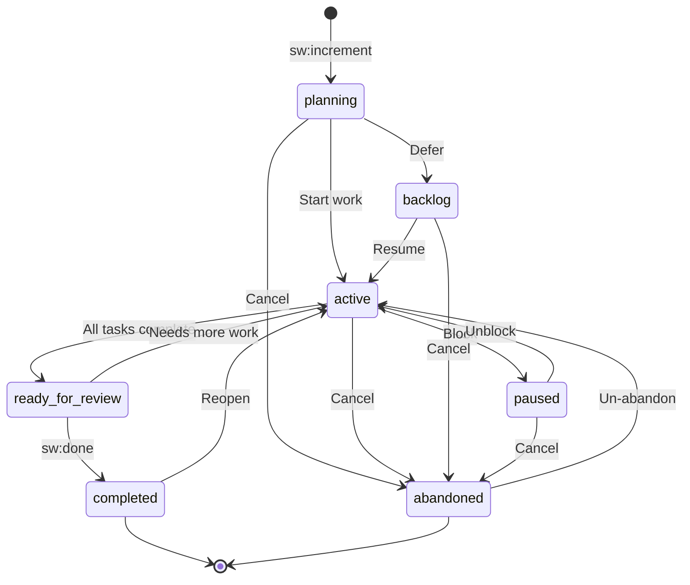

# Increment Metadata Reference

Every SpecWeave increment has a `metadata.json` file at `.specweave/increments/{id}/metadata.json`. This is the source of truth for increment state, configuration, and external tool links.

---

## Required Fields

| Field | Type | Description |
|-------|------|-------------|
| `id` | string | Increment identifier (e.g., `"0532-fix-hook-timeout"`) |
| `status` | string | Current lifecycle state (see Status Lifecycle below) |
| `type` | string | Increment classification (see Types below) |
| `created` | ISO 8601 | Creation timestamp |
| `lastActivity` | ISO 8601 | Last activity timestamp |

## Optional Fields

| Field | Type | Default | Description |
|-------|------|---------|-------------|
| `priority` | string | `"P1"` | Priority: P0, P1, P2, P3, critical, high, medium, low |
| `testMode` | string | `"TDD"` | Testing mode: TDD, test-after, test-first, manual, none |
| `coverageTarget` | number | `90` | Test coverage target (0-100, 0 = disabled) |
| `feature_id` | string | `null` | Feature ID (derived from increment number) |
| `epic_id` | string | `null` | Epic ID if part of an epic |
| `project` | string | — | Project identifier (for umbrella/workspace repos) |
| `skipLivingDocsSync` | boolean | `false` | Skip living docs sync for this increment |

---

## Status Lifecycle



### Status Values

| Status | WIP Counted | Description |
|--------|:-----------:|-------------|
| `planning` | No | Spec/plan/tasks being created |
| `active` | Yes | Currently being worked on |
| `backlog` | No | Planned but not ready |
| `paused` | Yes | Temporarily blocked |
| `ready_for_review` | Yes | All tasks complete, awaiting review |
| `completed` | No | Approved via sw:done |
| `abandoned` | No | Work abandoned |

### Critical Gates

- **active → ready_for_review**: Auto-transitions when all tasks marked complete
- **ready_for_review → completed**: Only via explicit `sw:done` with quality gates
- **Direct active → completed**: Not allowed — prevents auto-completion bugs

---

## Increment Types

| Type | WIP Limit | Auto-Abandon | Description |
|------|:---------:|:------------:|-------------|
| `feature` | 2 | — | New functionality |
| `bug` | unlimited | — | Bug fix requiring RCA |
| `hotfix` | unlimited | — | Critical production fix, bypasses all limits |
| `change-request` | 2 | — | Business/stakeholder changes |
| `refactor` | 1 | — | Technical debt reduction |
| `experiment` | unlimited | 14 days | POC/spike, auto-abandons after threshold |

---

## Lifecycle Timestamps

These fields are set automatically when status transitions occur:

| Field | Set When |
|-------|----------|
| `backlogAt` | Status → backlog |
| `backlogReason` | Status = backlog |
| `pausedAt` | Status → paused |
| `pausedReason` | Status = paused |
| `abandonedAt` | Status → abandoned |
| `abandonedReason` | Status = abandoned |
| `readyForReviewAt` | All tasks complete (auto) |
| `approvedAt` | sw:done completes |

---

## External Links

The `externalLinks` object tracks references to external tools. Each provider has its own schema.

### GitHub

```json
{
  "externalLinks": {
    "github": {
      "issues": {
        "US-001": {
          "issueNumber": 1573,
          "issueUrl": "https://github.com/org/repo/issues/1573",
          "status": "active"
        }
      },
      "milestone": 243,
      "syncedAt": "2026-03-15T16:49:06.925Z"
    }
  }
}
```

### JIRA

```json
{
  "externalLinks": {
    "jira": {
      "epicKey": "PROJ-220",
      "epicUrl": "https://domain.atlassian.net/browse/PROJ-220",
      "projectKey": "PROJ",
      "domain": "domain.atlassian.net",
      "syncedAt": "2026-03-15T17:04:28.435Z"
    }
  }
}
```

### Azure DevOps

```json
{
  "externalLinks": {
    "ado": {
      "featureId": "1366",
      "featureUrl": "https://dev.azure.com/org/project/_workitems/edit/1366",
      "organization": "MyOrg",
      "project": "MyProject",
      "syncedAt": "2026-03-15T17:04:30.186Z"
    }
  }
}
```

---

## Sync Target

Controls which sync profile handles this increment (v1.0.31+):

```json
{
  "syncTarget": {
    "profileId": "github-main",
    "provider": "github",
    "derivedFrom": "project-mapping",
    "setAt": "2026-03-15T08:52:13.086Z",
    "sourceProjectId": "frontend-app"
  }
}
```

`derivedFrom` values: `user-selection`, `project-mapping`, `default-profile`, `first-profile-fallback`, `auto-detected`

---

## PR References

Track pull requests linked to this increment (v1.0.437+):

```json
{
  "prRefs": [{
    "branch": "sw/0520-feature-branch",
    "prNumber": 42,
    "prUrl": "https://github.com/org/repo/pull/42",
    "repoSlug": "org/repo",
    "state": "open",
    "createdAt": "2026-03-12T10:00:00Z"
  }]
}
```

---

## Complete Example

```json
{
  "id": "0532-fix-hook-timeout-errors",
  "status": "completed",
  "type": "bug",
  "priority": "P1",
  "created": "2026-03-15T08:52:13.086Z",
  "lastActivity": "2026-03-15T17:04:20.194Z",
  "testMode": "TDD",
  "coverageTarget": 90,
  "feature_id": null,
  "epic_id": null,
  "project": "specweave",
  "externalLinks": {
    "github": {
      "issues": {
        "US-001": {
          "issueNumber": 1573,
          "issueUrl": "https://github.com/anton-abyzov/specweave/issues/1573",
          "status": "active"
        }
      },
      "milestone": 243,
      "syncedAt": "2026-03-15T16:49:06.925Z"
    },
    "jira": {
      "epicKey": "SWE2E-220",
      "epicUrl": "https://antonabyzov.atlassian.net/browse/SWE2E-220",
      "projectKey": "SWE2E",
      "domain": "antonabyzov.atlassian.net",
      "syncedAt": "2026-03-15T17:04:28.435Z"
    }
  },
  "syncTarget": {
    "profileId": "github-main",
    "provider": "github",
    "derivedFrom": "project-mapping",
    "setAt": "2026-03-15T08:52:13.086Z"
  },
  "readyForReviewAt": "2026-03-15T17:04:20.147Z",
  "approvedAt": "2026-03-15T17:04:20.194Z"
}
```
