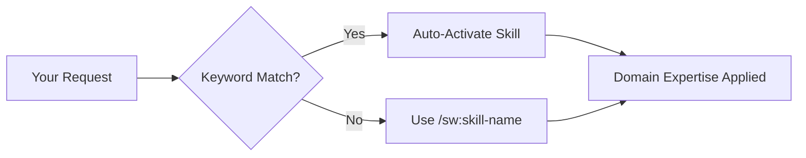

# Skills Reference

SpecWeave provides **100+ specialized skills** that activate automatically based on context or can be invoked directly. Skills are more powerful than commands - they provide domain expertise, best practices, and guided workflows.

:::tip Skills = Commands Now
In Claude Code, skills and slash commands execute identically. Use `/sw:skill-name` to invoke any skill. Skills auto-activate when their keywords are detected in your prompts.
:::

## How Skills Work



**Invocation methods:**
1. **Auto-activation**: Just describe what you need - skills activate based on keywords
2. **Direct invocation**: `/sw:skill-name` or `/sw-plugin:skill-name`
3. **Chaining**: Skills can invoke other skills for complex workflows

---

## Core Skills (Planning & Management)

These skills form the foundation of spec-driven development.

| Skill | Description | When to Use |
|-------|-------------|-------------|
| [`sw:increment`](#increment) | Plan and create increments with PM/Architect collaboration | Starting any new feature |
| [`sw:pm`](#pm) | Product Manager for specs, user stories, acceptance criteria | Writing requirements |
| [`sw:architect`](#architect) | System architect for technical designs and ADRs | Architecture decisions |
| [`sw:role-orchestrator`](#role-orchestrator) | Multi-agent coordination (PM, Architect, DevOps, QA) | Complex full-stack features |
| [`sw:roadmap-planner`](#roadmap-planner) | Product roadmap and feature prioritization | Quarterly planning |
| [`sw:plan`](#plan) | Generate plan.md and tasks.md for an existing increment | Regenerating plan/tasks |
| [`sw:brainstorm`](#brainstorm) | Multi-perspective ideation with cognitive lenses | Exploring approaches before committing |

### brainstorm

**Purpose**: Explore a problem from multiple angles before committing to an implementation path. Uses Tree of Thought divergent exploration with selectable cognitive lenses.

```bash
/sw:brainstorm "real-time notifications"              # Standard depth
/sw:brainstorm "auth system" --depth deep              # All 5 phases + deepening
/sw:brainstorm "payment gateway" --lens six-hats       # Specific lens
/sw:brainstorm "API design" --depth quick              # Fast 3-approach comparison
```

**5-Phase Flow:**
1. **Frame** — Problem statement, starbursting (5W1H), clarifying questions
2. **Diverge** — Generate 4-6 approaches via selected cognitive lens
3. **Evaluate** — Comparison matrix with scoring and explicit recommendation
4. **Deepen** (deep only) — Abstraction laddering, analogies, pre-mortem analysis
5. **Output** — Save persistent brainstorm doc, offer handoff to `/sw:increment`

**Depth Modes:**
- `quick` — 3 inline approaches, skip lenses (Phase 1+3)
- `standard` — Default lens, 4-6 approaches (Phase 1-3+5)
- `deep` — Multiple lenses via parallel subagents, all 5 phases

**Cognitive Lenses:**
- `default` — Independent parallel generation (conservative, bold, speed, extensibility)
- `six-hats` — Six Thinking Hats (facts, feelings, caution, optimism, creativity, process)
- `scamper` — SCAMPER transformations (substitute, combine, adapt, modify, repurpose, eliminate, reverse)
- `triz` — Constraint inversion (negate core assumptions)
- `adjacent` — Adjacent Possible (what recently became feasible)

**Additional features:**
- `--resume` — Pick up a previous brainstorm session
- `--criteria` — Custom evaluation criteria (e.g., `brand-fit,audience-reach,cost`)
- TRIZ lens includes 13 inventive principles adapted for software
- Adjacent Possible lens uses live web search to ground ideas in reality

**Output:** Persistent brainstorm document at `.specweave/docs/brainstorms/YYYY-MM-DD-topic.md` with idea tree for revisiting later.

**Full guide:** [Brainstorming with Cognitive Lenses](/docs/guides/brainstorming)

### increment

**Purpose**: Plan and create SpecWeave increments with PM and Architect collaboration.

```bash
/sw:increment "User authentication with JWT"
```

**What it does:**
- Detects tech stack automatically
- Runs PM-led spec creation
- Creates plan.md with architecture
- Generates tasks.md with proper AC-IDs

### pm

**Purpose**: Product Manager for spec-driven development.

```bash
/sw:pm  # Activate PM guidance
```

**Covers:**
- User story writing with proper format
- Acceptance criteria with testable AC-IDs
- MVP prioritization (MoSCoW, RICE)
- Requirements refinement

### architect

**Purpose**: System architect for scalable, maintainable designs.

```bash
/sw:architect  # Get architecture guidance
```

**Covers:**
- ADR (Architecture Decision Record) writing
- Microservices vs monolith decisions
- Database schema design
- Technology selection trade-offs

### role-orchestrator

**Purpose**: Multi-agent orchestration for complex features.

```bash
/sw:role-orchestrator "Build SaaS dashboard with payments"
```

**Coordinates:**
- PM for requirements
- Architect for design
- DevOps for infrastructure
- QA for testing strategy
- Security for compliance

---

## Execution & Workflow Skills

Control the development workflow from start to finish.

| Skill | Description | When to Use |
|-------|-------------|-------------|
| `sw:do` | Execute tasks manually | Task-by-task control |
| `sw:auto` | Autonomous execution | Hands-free development |
| `sw:auto-parallel` | Multi-agent parallel execution | Large features with isolation |
| `sw:auto-status` | Check autonomous progress | Monitoring from another session |
| `sw:cancel-auto` | Emergency stop | Only when auto mode needs abort |
| `sw:progress` | Show increment status | Checking completion |
| `sw:next` | Smart workflow transition | Completing and moving on |
| `sw:done` | Close increment | Finishing work |
| `sw:validate` | Rule-based validation | Quick quality check |
| `sw:qa` | AI quality gate | Pre-release assessment |
| `sw:grill` | Implementation auditor | Comprehensive code audit |

### auto

**Purpose**: Autonomous execution that runs for hours.

```bash
/sw:auto  # Start autonomous execution
```

**Features:**
- Continuous loop: Read task → Implement → Test → Fix → Next
- Self-healing: Retries failures up to 3 times
- Living docs sync: Updates documentation automatically
- Proven for 2-3 hour sessions

### grill

**Purpose**: Comprehensive implementation audit using parallel subagents.

```bash
/sw:grill                    # Full project audit
/sw:grill 0007               # Specific increment
/sw:grill src/auth           # Specific module
/sw:grill --focus security   # Focus on security
```

**Audits:**
- Structure and organization
- Code quality and patterns
- Consistency across codebase
- Documentation completeness
- Dependency health
- Test coverage
- Security vulnerabilities

---

## Quality & Testing Skills

Ensure code quality and test coverage.

| Skill | Plugin | Description |
|-------|--------|-------------|
| `sw:tdd-red` | sw | Write failing tests first |
| `sw:tdd-green` | sw | Minimal implementation to pass |
| `sw:tdd-refactor` | sw | Improve code quality |
| `sw:tdd-cycle` | sw | Full TDD workflow |
| `sw:code-reviewer` | sw | Elite multi-agent code review (6 parallel reviewers) |
| `sw:team-lead` | sw | Phase-agnostic orchestrator (brainstorm, plan, implement, review, research, test) |
| `sw:judge-llm` | sw | LLM-as-Judge quality assessment |
| `sw:debug` | sw | Systematic 4-phase debugging with escalation protocol |
| `sw:e2e` | sw | End-to-end testing skill |

### code-reviewer

**Purpose**: Elite multi-agent code review. Spawns up to 6 specialized reviewer agents in parallel, then aggregates findings into a unified report with deduplication and severity ranking.

```bash
/sw:code-reviewer                    # Auto-detect scope (PR, changes, or project)
/sw:code-reviewer --pr 42            # Review a specific PR
/sw:code-reviewer --changes          # Review uncommitted changes
/sw:code-reviewer --increment 0042   # Review changes from an increment
/sw:code-reviewer --cross-repo       # Aggregate across umbrella repos
```

**Specialized Reviewers (spawned in parallel):**
- **Logic** — bugs, edge cases, error handling, race conditions
- **Security** — OWASP Top 10, auth, secrets, injection
- **Performance** — N+1 queries, memory leaks, blocking ops
- **Silent Failures** — empty catches, swallowed errors, missing `.catch()`
- **Type Design** — unsafe assertions, overly broad types, missing invariants
- **Spec Compliance** — AC verification, scope creep detection (increment scope only)

**Smart routing**: Not all 6 reviewers run every time. Reviewers are selected based on what files changed (e.g., TypeScript files trigger the type reviewer, database files trigger performance).

**vs `/sw:grill`**: Grill is increment-scoped and runs during closure (mandatory gate). Code-reviewer is general-purpose — use it anytime on any scope.

### team-lead

**Purpose**: Phase-agnostic orchestrator for parallel multi-agent work. Auto-detects operating mode from your intent.

```bash
/sw:team-lead "Build checkout flow"              # Implementation mode (default)
/sw:team-lead "Brainstorm auth approaches"       # Brainstorm mode
/sw:team-lead "Plan the payment system"          # Planning mode
/sw:team-lead "Review recent changes"            # Review mode (delegates to code-reviewer)
/sw:team-lead "Research caching strategies"      # Research mode
/sw:team-lead "Write tests for checkout"         # Testing mode
/sw:team-lead --mode plan "user dashboard"       # Explicit mode override
```

**6 Operating Modes:**

| Mode | What It Does | Increment? |
|------|-------------|------------|
| **Brainstorm** | Spawns advocate + critic + pragmatist agents, synthesizes decision matrix | No |
| **Planning** | PM + Architect agents in parallel for richer specs | Creates one |
| **Implementation** | Domain agents (frontend, backend, database) with contract-first spawning | Required |
| **Review** | Delegates to `/sw:code-reviewer` for parallel multi-agent review | Optional |
| **Research** | 1-3 researcher agents exploring different facets of a topic | No |
| **Testing** | Testing agents split by layer (unit, integration, E2E) | Required |

---

## Frontend Skills

Build modern web applications with best practices. These are available as community skills via [verified-skill.com](https://verified-skill.com).

| Skill | Source | Description |
|-------|--------|-------------|
| `frontend` | community | General frontend development |
| `frontend-architect` | community | React/Vue/Angular architecture |
| `frontend-design` | community | UI/UX implementation |
| `design-system-architect` | community | Component library design |
| `nextjs` | community | Next.js App Router patterns |
| `code-explorer` | community | Codebase navigation |

### frontend-architect

**Purpose**: Frontend architecture for React, Vue, or Angular.

```bash
/sw:architect  # Frontend architecture guidance
```

**Covers:**
- Component composition patterns
- State management (Redux, Zustand, Pinia)
- Performance optimization
- Accessibility (a11y) requirements

### nextjs

**Purpose**: Next.js 14+ App Router patterns.

```bash
/sw:architect  # Next.js guidance
```

**Covers:**
- Server Components vs Client Components
- Route handlers and middleware
- Data fetching patterns
- Image and font optimization

---

## Backend Skills

Build scalable APIs and services. These are available as community skills via [verified-skill.com](https://verified-skill.com).

| Skill | Source | Description |
|-------|--------|-------------|
| `nodejs-backend` | community | Node.js/Express/Fastify APIs |
| `python-backend` | community | Python/FastAPI/Django services |
| `dotnet-backend` | community | .NET Core APIs |
| `database-optimizer` | community | SQL and NoSQL optimization |

### nodejs-backend

**Purpose**: Node.js backend development.

```bash
/backend:nodejs  # Node.js guidance
```

**Covers:**
- Express/Fastify patterns
- Middleware architecture
- Error handling
- Authentication (JWT, sessions)

### database-optimizer

**Purpose**: Database performance and design.

```bash
/backend:database-optimizer  # DB optimization
```

**Covers:**
- Query optimization
- Index strategies
- Connection pooling
- PostgreSQL, MySQL, MongoDB patterns

---

## Infrastructure & DevOps Skills

Deploy and operate at scale. These are available as community skills via [verified-skill.com](https://verified-skill.com).

| Skill | Source | Description |
|-------|--------|-------------|
| `devops` | community | CI/CD pipelines and deployment |
| `observability` | community | Logging, metrics, tracing |
| `infrastructure` | community | Terraform and cloud IaC |
| `k8s-manifest-generator` | community | Kubernetes manifests |
| `k8s-security-policies` | community | Pod security and RBAC |
| `helm-chart-scaffolding` | community | Helm chart creation |
| `gitops-workflow` | community | ArgoCD/Flux workflows |

### devops

**Purpose**: CI/CD and deployment automation.

```bash
/infra:devops  # DevOps guidance
```

**Covers:**
- GitHub Actions, GitLab CI
- Docker containerization
- Vercel, Cloudflare deployment
- Blue-green, canary deployments

### k8s-manifest-generator

**Purpose**: Generate Kubernetes manifests.

```bash
/k8s:deployment-generate  # K8s manifests
```

**Generates:**
- Deployments, Services, Ingress
- ConfigMaps, Secrets
- HPA, PDB for resilience
- Network policies

---

## External Sync Skills

Integrate with GitHub, JIRA, and Azure DevOps. All sync skills are part of the unified `sw` plugin.

| Skill | Plugin | Description |
|-------|--------|-------------|
| `github-sync` | sw | Bidirectional GitHub sync |
| `github-multi-project` | sw | Multi-repo GitHub coordination |
| `github-issue-standard` | sw | Issue formatting standards |
| `pr-review` | sw | Pull request review |
| `jira-sync` | sw | Bidirectional JIRA sync |
| `jira-mapper` | sw | Field mapping configuration |
| `jira-resource-validator` | sw | Validate JIRA resources |
| `ado-sync` | sw | Azure DevOps sync |
| `ado-multi-project` | sw | Multi-project ADO coordination |
| `ado-mapper` | sw | ADO field mapping |
| `ado-resource-validator` | sw | Validate ADO resources |

### github-sync

**Purpose**: Two-way sync between SpecWeave and GitHub Issues.

```bash
/sw:github-sync 0007  # Sync increment 0007 to GitHub
```

**Maps:**
- Feature → GitHub Milestone
- User Story → GitHub Issue
- Task → Issue checkbox

### jira-sync

**Purpose**: Bidirectional JIRA integration.

```bash
/sw:jira-sync 0007  # Sync to JIRA
```

**Maps:**
- Feature → JIRA Epic
- User Story → JIRA Story
- Task → JIRA Sub-task

---

## Data & Streaming Skills

Build event-driven architectures. These are available as community skills via [verified-skill.com](https://verified-skill.com).

| Skill | Source | Description |
|-------|--------|-------------|
| `kafka-architect` | community | Kafka architecture design |
| `kafka-ops` | community | Kafka operations and monitoring |
| `kafka-streams-topology` | community | Stream processing topologies |
| `confluent-kafka-connect` | community | Kafka Connect configuration |
| `confluent-schema-registry` | community | Avro/Protobuf schemas |
| `confluent-ksqldb` | community | ksqlDB streaming queries |

### kafka-architect

**Purpose**: Kafka event-driven architecture.

```bash
/kafka:architect  # Kafka architecture guidance
```

**Covers:**
- Topic design and partitioning
- Producer/consumer patterns
- Exactly-once semantics
- Schema evolution

---

## ML & AI Skills

Build machine learning systems.

| Skill | Source | Description |
|-------|--------|-------------|
| `ml-specialist` | community | ML model development |
| `ml-engineer` | community | ML pipeline engineering |
| `mlops-engineer` | community | MLOps and model deployment |
| `data-scientist` | community | Data analysis and experimentation |
| `image` | sw | AI image generation (Google Imagen 4 / Pollinations.ai) |
| `video` | sw | AI video generation (Google Veo 3.1 / Pollinations.ai) |
| `remotion` | sw | Programmatic video from React with Remotion |

### ml-specialist

**Purpose**: Machine learning model development.

```bash
/ml:engineer  # ML guidance
```

**Covers:**
- Model selection
- Feature engineering
- Training pipelines
- Model evaluation metrics

### image

**Purpose**: Generate images using AI. Google Imagen 4 (with `GEMINI_API_KEY`) or Pollinations.ai (free fallback).

```bash
/sw:image "hero image for SaaS landing page"
```

**Generates:**
- Hero images
- Icons and logos
- Product mockups

### video

**Purpose**: Generate videos using AI. Google Veo 3.1 (with `GEMINI_API_KEY`) or Pollinations.ai (free fallback).

```bash
/sw:video "product demo showing the dashboard in action"
```

### remotion

**Purpose**: Create programmatic videos with Remotion (React components rendered to MP4).

```bash
/sw:remotion "animated product launch video with logo reveal"
```
- Illustrations

---

## Mobile Skills

Build cross-platform mobile apps. Install via: `npx vskill install --repo anton-abyzov/vskill --plugin mobile`

| Skill | Plugin | Description |
|-------|--------|-------------|
| `appstore` | mobile (vskill) | App Store Connect automation and submission |

### appstore

**Purpose**: App Store Connect automation and submission management.

```bash
/mobile:appstore  # App store guidance
```

**Covers:**
- App Store Connect submission workflow
- Screenshot and metadata management
- Build and version coordination
- Release management

---

## Security & Compliance Skills

Build secure, compliant systems. These are available as community skills via [verified-skill.com](https://verified-skill.com).

| Skill | Source | Description |
|-------|--------|-------------|
| `security` | community | Security assessment and hardening |
| `security-patterns` | community | Real-time security pattern detection |
| `compliance-architecture` | community | SOC 2, HIPAA, GDPR compliance |
| `pci-compliance` | community | PCI-DSS for payments |

### security

**Purpose**: Security vulnerability assessment.

```bash
/sw:security  # Security guidance
```

**Covers:**
- OWASP Top 10
- Authentication/authorization flaws
- Injection vulnerabilities
- Security headers

### compliance-architecture

**Purpose**: Enterprise compliance for regulated industries.

```bash
/sw:compliance-architecture  # Compliance guidance
```

**Covers:**
- SOC 2 Type II controls
- HIPAA for healthcare
- GDPR for EU data
- PCI-DSS for payments

---

## Payments Skills

Build payment systems. These are available as community skills via [verified-skill.com](https://verified-skill.com).

| Skill | Source | Description |
|-------|--------|-------------|
| `payments` | community | Payment integration patterns |
| `billing-automation` | community | Subscription and billing |
| `pci-compliance` | community | PCI-DSS compliance |

### payments

**Purpose**: Payment gateway integration.

```bash
/payments:payment-core  # Payment guidance
```

**Covers:**
- Stripe integration
- Webhook handling
- Idempotency patterns
- Refund workflows

---

## Documentation Skills

Create and maintain documentation. These are available as community skills via [verified-skill.com](https://verified-skill.com).

| Skill | Source | Description |
|-------|--------|-------------|
| `docs-writer` | community | Technical documentation |
| `living-docs` | community | Living documentation management |
| `living-docs-navigator` | community | Navigate project docs |
| `technical-writing` | community | Technical writing best practices |
| `docusaurus` | community | Docusaurus site management |

### docs-writer

**Purpose**: Technical documentation generation.

```bash
/sw:docs-writer  # Generate documentation
```

**Creates:**
- API documentation
- README files
- User guides
- Developer onboarding

### docusaurus

**Purpose**: Docusaurus documentation site.

```bash
/docs:docusaurus  # Docusaurus guidance
```

**Covers:**
- MDX components
- Sidebar configuration
- Versioning
- Search integration

---

## Cost Optimization Skills

Optimize cloud spending. These are available as community skills via [verified-skill.com](https://verified-skill.com).

| Skill | Source | Description |
|-------|--------|-------------|
| `cost-optimization` | community | General cost reduction |
| `aws-cost-expert` | community | AWS cost analysis |
| `cloud-pricing` | community | Multi-cloud pricing comparison |

### cost-optimization

**Purpose**: Cloud cost reduction strategies.

```bash
/cost:cost-optimization  # Cost analysis
```

**Covers:**
- Right-sizing instances
- Reserved capacity planning
- Spot instance strategies
- Storage tier optimization

---

## Utility Skills

General-purpose development utilities. These are available as community skills via [verified-skill.com](https://verified-skill.com).

| Skill | Source | Description |
|-------|--------|-------------|
| `code-simplifier` | community | Code clarity improvement |
| `reflect` | community | Learning from corrections |
| `translator` | community | Content translation |
| `context-loader` | community | Context efficiency |
| `detector` | community | SpecWeave workflow detection |
| `lsp` | community | Code navigation (find refs, go to def) |
| `brownfield-analyzer` | community | Existing project analysis |
| `brownfield-onboarder` | community | Project migration |
| `framework` | community | SpecWeave framework guide |
| `service-connect` | community | External service connection |

### code-simplifier

**Purpose**: Improve code clarity without changing behavior.

```bash
/sw:code-simplifier  # Simplify recent changes
```

**Does:**
- Removes unnecessary complexity
- Improves variable naming
- Extracts functions appropriately
- Never changes functionality

### lsp

**Purpose**: Code navigation (LSP workaround for Claude Code v2.1.0+).

```bash
/sw:lsp refs MyFunction     # Find references
/sw:lsp def MyClass         # Go to definition
/sw:lsp hover file.ts 42 10 # Type info at position
```

---

## Release & Versioning Skills

Manage releases and versions.

| Skill | Plugin | Description |
|-------|--------|-------------|
| `release-expert` | sw | Release orchestration and version alignment |

### release-expert

**Purpose**: Full release orchestration, version alignment, and coordination.

```bash
/sw:release-expert  # Release guidance
```

**Covers:**
- Semantic versioning and version alignment
- Multi-repo release coordination and waves
- RC lifecycle management
- Changelog generation and rollback procedures

---

## Diagrams & Visualization Skills

Create technical diagrams.

| Skill | Plugin | Description |
|-------|--------|-------------|
| `diagrams` | sw | Architecture diagram design and generation |

### diagrams

**Purpose**: Create and generate Mermaid/C4 diagrams.

```bash
/sw:diagrams  # Create diagrams
```

**Creates:**
- C4 architecture diagrams (Context, Container, Component)
- Sequence diagrams
- Entity relationship diagrams
- Deployment diagrams

---

## Workflow Automation Skills

Automate with n8n. These are available as community skills via [verified-skill.com](https://verified-skill.com).

| Skill | Source | Description |
|-------|--------|-------------|
| `n8n-kafka-workflows` | community | Kafka + n8n automation |

### n8n-kafka-workflows

**Purpose**: Event-driven workflow automation.

```bash
# Available as community skill — install from verified-skill.com
```

**Creates:**
- Kafka trigger nodes
- Event processing workflows
- Webhook integrations

---

## Installing Plugins

The unified `sw` plugin ships with SpecWeave and installs automatically via `specweave init`. It includes all 44 core skills (GitHub, JIRA, ADO sync, release, diagrams, media, and more).

Additional domain plugins are available from the vskill marketplace:

```bash
# Install the SpecWeave core plugin (usually handled by specweave init)
npx vskill install --repo anton-abyzov/specweave --plugin sw

# Install domain plugins from the vskill marketplace
npx vskill install --repo anton-abyzov/vskill --plugin mobile
npx vskill install --repo anton-abyzov/vskill --plugin marketing
npx vskill install --repo anton-abyzov/vskill --plugin google-workspace
npx vskill install --repo anton-abyzov/vskill --plugin productivity
npx vskill install --repo anton-abyzov/vskill --plugin skills
```

Browse 100,000+ community skills at [verified-skill.com](https://verified-skill.com):

```bash
npx vskill find "react"
npx vskill install <skill-name>
```

---

## Next Steps

- [Commands Reference](./commands) - Execution-focused command guide
- [Quick Start](/docs/getting-started) - Get started in 5 minutes
- [Auto Mode Deep Dive](/docs/commands/auto) - Autonomous execution details
