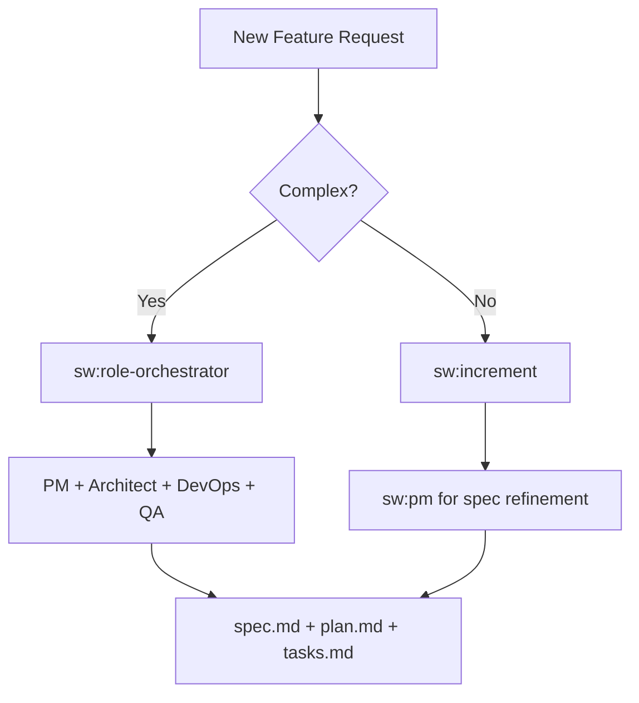
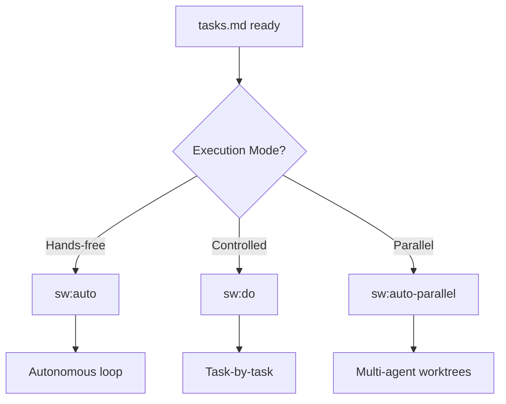
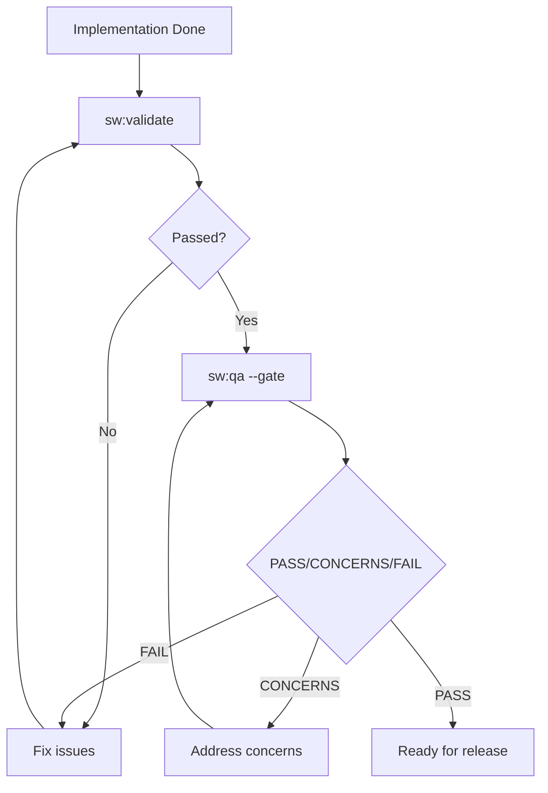
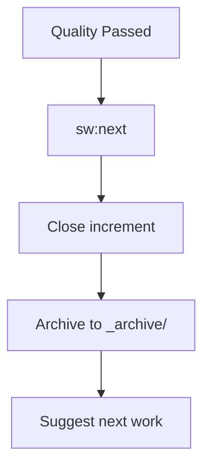

# Use Case Guide

Find the right SpecWeave skill or command for what you're trying to do. Every skill supports three invocation methods -- natural language, slash commands, and CLI keywords.

## "I want to..." Quick Lookup

### Planning & Starting Work

| I want to... | Natural Language | Claude Code | Other AI |
|--------------|-----------------|-------------|----------|
| Start a new feature | "Let's build X" | `sw:increment "X"` | `increment "X"` |
| Get help writing specs | "Write specs" | `sw:pm` | `pm` |
| Design system architecture | "Design the system" | `sw:architect` | `architect` |
| Plan a product roadmap | "Plan the roadmap" | `sw:roadmap-planner` | `roadmap-planner` |
| Break down a complex feature | "Coordinate all agents" | `sw:role-orchestrator` | `role-orchestrator` |
| Create tasks with test plans | "Generate tasks" | `sw:plan` | `plan` |

### Implementing Features

| I want to... | Natural Language | Claude Code | Other AI |
|--------------|-----------------|-------------|----------|
| Work autonomously (hours) | "Ship while I sleep" | `sw:auto` | `auto` |
| Work task-by-task manually | "Start implementing" | `sw:do` | `do` |
| Work with multiple agents | "Parallel agents" | `sw:auto-parallel` | `auto-parallel` |
| Orchestrate parallel teams | "Team work on X" | `sw:team-lead "X"` | `team-lead "X"` |
| Brainstorm with agents | "Brainstorm X" | `sw:team-lead "brainstorm X"` | `team-lead "brainstorm X"` |
| Plan with PM + Architect | "Plan X with a team" | `sw:team-lead "plan X"` | `team-lead "plan X"` |
| Research a topic with agents | "Research X" | `sw:team-lead "research X"` | `team-lead "research X"` |
| Check auto mode progress | "Check auto progress" | `sw:auto-status` | `auto-status` |
| Get frontend help | "Help with React" | `sw:architect` | `architect` |
| Get Node.js API help | "Node.js API" | `/backend:nodejs` | `nodejs` |
| Optimize database queries | "Optimize queries" | `/backend:database-optimizer` | `database-optimizer` |
| Set up Kubernetes | "K8s deployment" | `/k8s:deployment-generate` | `deployment-generate` |
| Design Kafka architecture | "Kafka event design" | `/kafka:architect` | `kafka-architect` |

### Testing & Quality

| I want to... | Natural Language | Claude Code | Other AI |
|--------------|-----------------|-------------|----------|
| Validate quickly (rules) | "Check quality" | `sw:validate` | `validate` |
| AI quality assessment | "Assess quality" | `sw:qa --gate` | `qa --gate` |
| Deep implementation audit | "Review my work" | `sw:grill` | `grill` |
| Follow TDD strictly | "Test-driven development" | `sw:tdd-cycle` | `tdd-cycle` |
| Write failing tests first | "Write failing tests" | `sw:tdd-red` | `tdd-red` |
| Write E2E tests | "E2E tests" | `sw:e2e` | `e2e` |
| Code review my changes | "Review code" | `sw:code-reviewer` | `code-reviewer` |
| Review a specific PR | "Review PR 42" | `sw:code-reviewer --pr 42` | `code-reviewer --pr 42` |

### Completing & Managing Work

| I want to... | Natural Language | Claude Code | Other AI |
|--------------|-----------------|-------------|----------|
| Finish and get next task | "What's next?" | `sw:next` | `next` |
| Close specific increment | "We're done" | `sw:done 0007` | `done 0007` |
| Check progress | "How far along?" | `sw:progress` | `progress` |
| Pause for later | "Put this on hold" | `sw:pause` | `pause` |
| Resume paused work | "Continue working" | `sw:resume` | `resume` |
| Abandon increment | "Cancel this" | `sw:abandon` | `abandon` |

### Syncing with External Tools

| I want to... | Natural Language | Claude Code | Other AI |
|--------------|-----------------|-------------|----------|
| Sync to GitHub Issues | "Sync to GitHub" | `sw-github:sync` | `github-sync` |
| Sync to JIRA | "Sync to JIRA" | `sw-jira:sync` | `jira-sync` |
| Sync to Azure DevOps | "Sync to ADO" | `sw-ado:sync` | `ado-sync` |
| Configure external sync | "Set up sync" | `sw:external-sync-wizard` | `external-sync-wizard` |

### Documentation

| I want to... | Natural Language | Claude Code | Other AI |
|--------------|-----------------|-------------|----------|
| Write technical docs | "Write documentation" | `sw:docs-writer` | `docs-writer` |
| Update living docs | "Update the docs" | `sw:sync-docs` | `sync-docs` |
| Navigate project docs | "Show me the docs" | `sw:living-docs-navigator` | `living-docs-navigator` |
| Build Docusaurus site | "Docusaurus setup" | `/docs:docusaurus` | `docusaurus` |

### Security & Compliance

| I want to... | Natural Language | Claude Code | Other AI |
|--------------|-----------------|-------------|----------|
| Security assessment | "Security review" | `sw:security` | `security` |
| Detect security patterns | "Check for vulnerabilities" | `sw:security-patterns` | `security-patterns` |
| SOC 2/HIPAA compliance | "Compliance check" | `sw:compliance-architecture` | `compliance-architecture` |
| PCI-DSS for payments | "PCI compliance" | `/payments:pci-compliance` | `pci-compliance` |

### Cost & Performance

| I want to... | Natural Language | Claude Code | Other AI |
|--------------|-----------------|-------------|----------|
| Optimize cloud costs | "Reduce cloud costs" | `/cost:cost-optimization` | `cost-optimization` |
| Analyze AWS costs | "AWS cost analysis" | `/cost:aws-cost-expert` | `aws-cost-expert` |
| Improve performance | "Optimize performance" | `sw:performance` | `performance` |

---

## By Role

### I'm a Product Manager

```bash
sw:pm                    # Requirements, user stories, ACs
sw:roadmap-planner       # Quarterly planning, prioritization
sw:increment "feature"   # Start new work
sw:progress              # Track team progress
```

### I'm an Architect

```bash
sw:architect             # System design, ADRs
sw:role-orchestrator     # Coordinate multiple agents
/infra:devops             # CI/CD, deployment
sw:security              # Security review
```

### I'm a Frontend Developer

```bash
sw:architect                # React/Vue patterns
sw:architect                   # Next.js specifics
sw:architect  # Component library
sw:auto                           # Autonomous implementation
```

### I'm a Backend Developer

```bash
/backend:nodejs                     # Node.js APIs
/backend:database-optimizer        # SQL optimization
/kafka:architect                   # Event-driven design
sw:auto                           # Autonomous implementation
```

### I'm a DevOps Engineer

```bash
/infra:devops                      # CI/CD pipelines
/k8s:deployment-generate           # K8s manifests
/k8s:gitops-workflow               # ArgoCD/Flux
/infra:terraform                   # Terraform IaC
```

### I'm a QA Engineer

```bash
/testing:qa                         # Test strategy
/testing:e2e                       # Playwright E2E
/testing:unit                      # Unit test patterns
sw:tdd-cycle               # TDD workflow
sw:grill                          # Implementation audit
```

### I'm a Security Engineer

```bash
sw:security                       # Vulnerability assessment
sw:security-patterns              # Real-time detection
sw:compliance-architecture        # Compliance frameworks
/payments:pci-compliance            # PCI-DSS
```

---

## By Phase

### Phase 1: Planning



**Commands/Skills:**
- `sw:increment "feature"` - Create increment
- `sw:pm` - Product management
- `sw:architect` - Architecture design
- `sw:role-orchestrator` - Multi-agent coordination

### Phase 2: Implementation



**Commands/Skills:**
- `sw:auto` - Autonomous execution
- `sw:do` - Manual execution
- `sw:*` - Frontend skills
- `/backend:*` - Backend skills

### Phase 3: Quality



**Commands/Skills:**
- `sw:validate` - Rule-based checks
- `sw:qa --gate` - AI quality gate
- `sw:grill` - Deep audit
- `sw:code-reviewer` - Code review

### Phase 4: Completion



**Commands/Skills:**
- `sw:next` - Complete and suggest next
- `sw:done` - Close increment
- `sw-github:sync` - Sync to GitHub

---

## Common Workflows

### Start to Finish (Autonomous)

```bash
# 1. Create increment
sw:increment "User authentication with JWT"

# 2. Let it run (go grab coffee, lunch, or sleep)
sw:auto

# 3. Check from another terminal (optional)
sw:auto-status

# 4. Complete when done
sw:next

# 5. Sync to GitHub (optional)
sw-github:sync 0007
```

### TDD Workflow

```bash
# 1. Create increment
sw:increment "Payment processing"

# 2. TDD cycle
sw:tdd-cycle

# OR step by step:
sw:tdd-red        # Write failing tests
sw:tdd-green      # Minimal implementation
sw:tdd-refactor   # Clean up

# 3. Quality gate
sw:qa --gate

# 4. Complete
sw:next
```

### Quality-First Release

```bash
# 1. Quick validation
sw:validate 0007

# 2. Deep audit
sw:grill 0007 --full

# 3. AI quality gate
sw:qa 0007 --gate

# 4. Code review
sw:code-reviewer

# 5. Security check
sw:security

# 6. Complete
sw:done 0007
```

### Multi-Repo Project

```bash
# 1. Detect repo structure
sw:umbrella-repo-detector

# 2. Create coordinated increment
sw:increment "Feature spanning FE + BE"

# 3. Parallel execution
sw:auto-parallel

# 4. Sync all to GitHub
sw-github:github-multi-project
```

---

## Decision Trees

### Which Execution Mode?

```
Start Implementation
        │
        ▼
┌───────────────────┐
│ Do I need to make │
│ decisions during  │──Yes──▶ sw:do (manual)
│ implementation?   │
└───────────────────┘
        │No
        ▼
┌───────────────────┐
│ Are there isolated│
│ parallel work     │──Yes──▶ sw:auto-parallel
│ streams (FE/BE)?  │
└───────────────────┘
        │No
        ▼
    sw:auto (autonomous)
```

### Which Quality Check?

```
Want Quality Check
        │
        ▼
┌───────────────────┐
│ Quick validation  │
│ (rules only)?     │──Yes──▶ sw:validate
└───────────────────┘
        │No
        ▼
┌───────────────────┐
│ Deep code audit   │
│ with parallel     │──Yes──▶ sw:grill
│ analysis?         │
└───────────────────┘
        │No
        ▼
    sw:qa --gate (AI quality)
```

### Which Sync Command?

```
Sync to External Tool
        │
        ▼
┌───────────────────┐
│ Which tool?       │
└───────────────────┘
        │
    ┌───┴───┬───────┐
    ▼       ▼       ▼
 GitHub   JIRA    ADO
    │       │       │
    ▼       ▼       ▼
sw-github sw-jira sw-ado
  :sync     :sync    :sync
```

---

## Skill Auto-Activation Keywords

Skills activate automatically when you use these keywords in natural language. You can also use slash commands or CLI keywords directly.

| Natural Language Keywords | Claude Code | Other AI |
|--------------------------|-------------|----------|
| "user story", "acceptance criteria", "requirements" | `sw:pm` | `pm` |
| "architecture", "ADR", "design decision" | `sw:architect` | `architect` |
| "React", "Vue", "Angular", "frontend" | `sw:architect` | `architect` |
| "Node.js", "Express", "API endpoint" | `/backend:nodejs` | `nodejs` |
| "database", "SQL", "query optimization" | `/backend:database-optimizer` | `database-optimizer` |
| "Kubernetes", "K8s", "pods", "deployment" | `/k8s:deployment-generate` | `deployment-generate` |
| "Kafka", "events", "streaming" | `/kafka:architect` | `kafka-architect` |
| "test", "TDD", "unit test", "E2E" | `sw:tdd-cycle` | `tdd-cycle` |
| "security", "OWASP", "vulnerability" | `sw:security` | `security` |
| "compliance", "SOC 2", "HIPAA", "GDPR" | `sw:compliance-architecture` | `compliance-architecture` |

---

## Next Steps

- [Skills Reference](./skills) - Complete skills list
- [Commands Reference](./commands) - Complete commands list
- [Quick Start](/docs/getting-started) - Get started in 5 minutes
