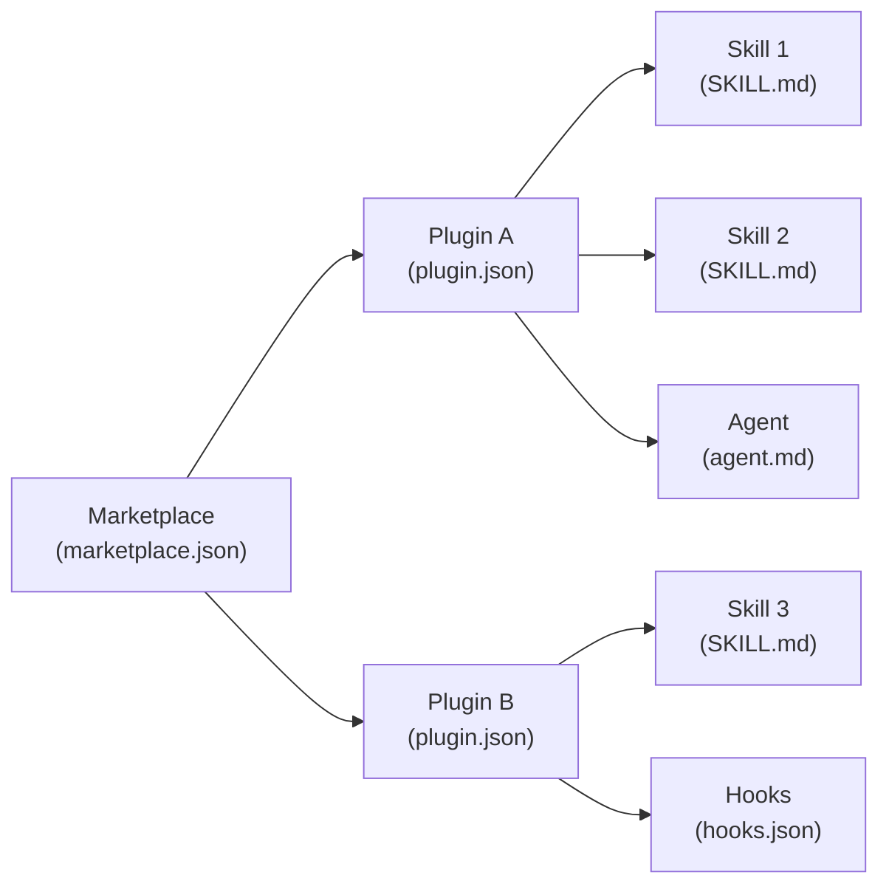

# Skills, Plugins & Marketplaces Explained

There's a lot of confusion around skills, plugins, and marketplaces in Claude Code. This guide clears it up with a practical lens — including how SpecWeave uses all three at scale.

:::tip TL;DR
**Skill** = a markdown file with instructions for Claude. **Plugin** = a package of skills + agents + hooks. **Marketplace** = a catalog of plugins. **Command** = the old name for skills.
:::

---

## The 4 Concepts

| Concept | What It Is | File | Analogy |
|---------|-----------|------|---------|
| **Skill** | A `SKILL.md` file with instructions | `SKILL.md` | An app |
| **Plugin** | A directory bundling skills + agents + hooks + MCP | `plugin.json` | An app bundle |
| **Marketplace** | A JSON catalog listing available plugins | `marketplace.json` | An app store |
| **Command** | Legacy name for skills (`.claude/commands/*.md`) | `*.md` | Same as skill |

**The hierarchy**: Marketplace contains Plugins, each Plugin contains Skills.



---

## Skills — The Building Block

A skill is a **markdown file** (`SKILL.md`) that tells Claude what to do. It's a program written in English.

### Where Skills Live

Where you store a skill determines who can use it:

| Location | Path | Scope |
|----------|------|-------|
| **Personal** | `~/.claude/skills/<name>/SKILL.md` | All your projects |
| **Project** | `.claude/skills/<name>/SKILL.md` | This repo only |
| **Plugin** | `<plugin>/skills/<name>/SKILL.md` | Where plugin is installed |
| **Enterprise** | Managed settings | Entire organization |

Higher-priority locations win: Enterprise > Personal > Project. Plugin skills use namespacing (`/plugin:skill`), so they never conflict with other levels.

### Anatomy of a SKILL.md

Every skill has two parts: **YAML frontmatter** (configuration) and **markdown body** (instructions).

```yaml
---
name: deploy
description: Deploy the application to production
disable-model-invocation: true
allowed-tools: Bash, Read
model: opus
context: fork
agent: Explore
argument-hint: "[environment]"
hooks:
  PostToolUse:
    - matcher: Bash
      hooks:
        - type: command
          command: echo "Deploy completed"
---

Deploy $ARGUMENTS to production:

1. Run the test suite
2. Build the application
3. Push to the deployment target
4. Verify the deployment succeeded
```

### Frontmatter Fields

| Field | What It Does |
|-------|-------------|
| `name` | Display name, becomes the `/slash-command` |
| `description` | Tells Claude when to auto-activate this skill |
| `disable-model-invocation` | `true` = only YOU can invoke (Claude cannot auto-trigger) |
| `user-invocable` | `false` = hidden from `/` menu (background knowledge only) |
| `allowed-tools` | Restrict which tools Claude can use |
| `model` | Which model to use (`opus`, `sonnet`, `haiku`) |
| `context` | `fork` = runs in an isolated subagent |
| `agent` | Which agent type for the fork (`Explore`, `Plan`, etc.) |
| `argument-hint` | Autocomplete hint shown in UI |
| `hooks` | Lifecycle hooks scoped to this skill |

### Two Invocation Modes

Skills can be triggered two ways:

**1. You invoke directly** — type `/skill-name` (or `/skill-name args`):

```
/deploy staging
```

**2. Claude auto-invokes** — Claude reads the `description` field and decides the skill is relevant to your conversation:

```
You: "Let's design the authentication architecture"
         ↓
Claude matches "architecture" → sw:architect skill activates
```

### Controlling Who Can Invoke

| Frontmatter | You Can Invoke | Claude Can Invoke | Use Case |
|-------------|---------------|-------------------|----------|
| (default) | Yes | Yes | Most skills |
| `disable-model-invocation: true` | Yes | No | Dangerous ops (deploy, commit) |
| `user-invocable: false` | No | Yes | Background knowledge |

### Arguments and Dynamic Context

**Arguments** — use `$ARGUMENTS` (or `$0`, `$1` for positional):

```yaml
---
name: fix-issue
description: Fix a GitHub issue
---

Fix GitHub issue $ARGUMENTS following our coding standards.
```

Running `/fix-issue 123` sends "Fix GitHub issue 123..."

**Dynamic context injection** — `!`command`` runs shell commands before Claude sees the content:

```yaml
---
name: pr-summary
description: Summarize a pull request
---

PR diff: !`gh pr diff`
Changed files: !`gh pr diff --name-only`

Summarize this pull request.
```

The shell output replaces the placeholder. Claude only sees the final rendered prompt.

### Supporting Files

Skills can include a directory of files, not just `SKILL.md`:

```
my-skill/
├── SKILL.md           # Main instructions (required)
├── template.md        # Template for Claude to fill in
├── examples/
│   └── sample.md      # Example output
└── scripts/
    └── validate.sh    # Script Claude can execute
```

Reference them from `SKILL.md` so Claude knows when to load them.

### Commands = Legacy Skills

Files in `.claude/commands/review.md` and `.claude/skills/review/SKILL.md` both create `/review` and work the same way. Commands are the old format — skills are recommended because they support directories with supporting files and additional frontmatter features.

---

## Plugins — The Distribution Package

A plugin bundles **multiple skills + agents + hooks + MCP servers** into one installable package.

### Plugin Structure

```
my-plugin/
├── .claude-plugin/
│   └── plugin.json          # Manifest (required)
├── skills/                  # Skills (SKILL.md files)
│   ├── code-review/
│   │   └── SKILL.md
│   └── deploy/
│       └── SKILL.md
├── agents/                  # Custom subagent definitions
├── hooks/                   # Event handlers
│   └── hooks.json
├── .mcp.json                # MCP server configs
├── .lsp.json                # LSP server configs
└── settings.json            # Default settings
```

:::warning Common Mistake
Don't put `skills/`, `agents/`, `hooks/` inside `.claude-plugin/`. Only `plugin.json` goes there. Everything else lives at the plugin root.
:::

### Plugin Manifest

The manifest at `.claude-plugin/plugin.json` defines your plugin's identity:

```json
{
  "name": "my-plugin",
  "description": "What this plugin does",
  "version": "1.0.0",
  "author": {
    "name": "Your Name"
  }
}
```

### Namespacing

Plugin skills are always prefixed with the plugin name to prevent conflicts:

```
/my-plugin:code-review     ← skill "code-review" from plugin "my-plugin"
/my-plugin:deploy           ← skill "deploy" from plugin "my-plugin"
```

If two plugins both have a "deploy" skill, they become `/plugin-a:deploy` and `/plugin-b:deploy`. No collision.

### Testing Locally

Use `--plugin-dir` to load a plugin during development without installing it:

```bash
claude --plugin-dir ./my-plugin
```

---

## Marketplaces — The Distribution Channel

A marketplace is a **JSON catalog** that lists plugins and tells Claude Code where to download them.

### Marketplace File

Create `.claude-plugin/marketplace.json` in your repository root:

```json
{
  "name": "my-marketplace",
  "owner": {
    "name": "Your Name"
  },
  "plugins": [
    {
      "name": "review-plugin",
      "source": "./plugins/review-plugin",
      "description": "Code review tools",
      "version": "1.0.0",
      "category": "development"
    },
    {
      "name": "deploy-tools",
      "source": {
        "source": "github",
        "repo": "company/deploy-plugin"
      },
      "description": "Deployment automation"
    }
  ]
}
```

### Plugin Sources

Each plugin entry specifies where to fetch it from:

| Source Type | Format | Example |
|------------|--------|---------|
| **Relative path** | `"./plugins/my-plugin"` | Plugin in same repo |
| **GitHub** | `{ "source": "github", "repo": "owner/repo" }` | Any GitHub repo |
| **Git URL** | `{ "source": "url", "url": "https://gitlab.com/...git" }` | Any Git host |
| **npm** | `{ "source": "npm", "package": "pkg-name" }` | npm registry |

### The User Flow

```bash
# Step 1: Add the marketplace (registers the catalog)
/plugin marketplace add owner/repo

# Step 2: Browse what's available
/plugin                          # opens interactive UI

# Step 3: Install a plugin
/plugin install plugin-name@marketplace-name

# Step 4: Use the skills
/plugin-name:skill-name
```

### Official Marketplace

The official Anthropic marketplace (`claude-plugins-official`) comes pre-configured. It includes:

- **Code intelligence** — LSP plugins for TypeScript, Python, Rust, Go, etc.
- **External integrations** — GitHub, Slack, Jira, Figma, Vercel, Sentry
- **Workflow tools** — commit commands, PR review toolkit

### Where Installed Plugins Live

```
~/.claude/plugins/
├── installed_plugins.json     # Registry of what's installed
└── cache/                     # Cached plugin files
    └── marketplace-name/
        └── plugin-name/
            └── version/
                ├── .claude-plugin/plugin.json
                └── skills/...
```

---

## Real-World Example: SpecWeave

SpecWeave is delivered as a set of Claude Code plugins through its own marketplace. Here's what that looks like at scale.

### The Marketplace

SpecWeave's `marketplace.json` registers **22 plugins** with **126 skills** total:

| Plugin | Skills | Domain |
|--------|--------|--------|
| `sw` (core) | 37 | Workflow, PM, TDD, team orchestration |
| `frontend` | 7 | React, Next.js, Vue, design systems |
| `backend` | 8 | Node.js, Python, .NET, Go, Java, GraphQL, Rust |
| `testing` | 5 | QA, E2E, unit, mutation, performance |
| `infra` | 10 | Terraform, AWS, GCP, monitoring |
| `mobile` | 10 | React Native, Flutter, SwiftUI, Compose |
| `k8s` | 6 | Kubernetes, Helm, GitOps |
| `sw-github` | 10 | GitHub sync |
| `sw-jira` | 10 | JIRA sync |
| `ml` | 10 | ML pipelines, RAG, fine-tuning |
| `payments` | 6 | Stripe, billing, PCI compliance |
| `docs` | 8 | Docusaurus, living docs |
| ...and more | | |

### Simple vs Complex Skills

**A simple domain skill** has minimal frontmatter — just description and tools:

```yaml
---
description: Node.js/TypeScript backend developer for Express, Fastify, NestJS...
allowed-tools: Read, Write, Edit, Bash
model: opus
---

When building Node.js APIs, follow these patterns:
[detailed instructions...]
```

**A complex workflow skill** uses hooks, dynamic context, and subagent forking:

```yaml
---
description: Plan and create SpecWeave increments
argument-hint: "<feature-description>"
context: fork
model: opus
hooks:
  PreToolUse:
    - matcher: Write
      hooks:
        - type: command
          command: bash hooks/guards/template-enforcement.sh
  PostToolUse:
    - matcher: Write
      hooks:
        - type: command
          command: bash hooks/guards/duplicate-guard.sh
---
```

### Skill Chaining

Skills invoke other skills for multi-step workflows:

```
/sw:increment "user auth"
    → sw:pm skill activates (Product Manager writes spec)
        → sw:architect skill activates (designs the system)
            → backend:nodejs activates (implements)
```

### Dynamic Context Injection

SpecWeave skills inject project-specific overrides at load time using shell one-liners:

```yaml
## Your Project's Customizations
!`for d in .specweave/skill-memories .claude/skill-memories; do
  [ -f "$d/pm.md" ] && cat "$d/pm.md"
done`
```

This loads "skill memories" — corrections you've made that persist across sessions. You tell Claude "use React Hook Form" once, and it remembers next time the PM skill activates.

### Plugins Load On-Demand

You don't install 22 plugins manually. SpecWeave plugins load based on what you're working on:

- Say "React frontend" → `frontend` activates
- Say "deploy to Kubernetes" → `k8s` activates
- Say "write tests" → `testing` activates

---

## Key Takeaways

1. **Skill = just a SKILL.md file** — instructions for Claude in markdown
2. **Plugin = a package** — bundles skills + agents + hooks with a `plugin.json` manifest
3. **Marketplace = a catalog** — lists plugins and where to download them via `marketplace.json`
4. **Commands = old name for skills** — `.claude/commands/` still works, but skills are the current standard
5. **Namespacing prevents conflicts** — plugin skills become `/plugin:skill`
6. **Two invocation modes** — you call it with `/name`, or Claude auto-triggers based on the description
7. **Real scale** — SpecWeave ships 126 skills across 22 plugins through a single marketplace

---

## Next Steps

- [Extensible Skills Standard](/docs/skills/extensible/) — How to customize skills for your project
- [Verified Skills Standard](/docs/skills/verified/) — How to evaluate skill security and trust
- [Claude Code Skills Docs](https://code.claude.com/docs/en/skills) — Official Anthropic documentation
- [Claude Code Plugins Docs](https://code.claude.com/docs/en/plugins) — Creating and distributing plugins
- [All 100+ SpecWeave Skills](/docs/reference/skills) — Browse the complete catalog
- [verifiedskill.com](https://verifiedskill.com) — The trusted skill registry
