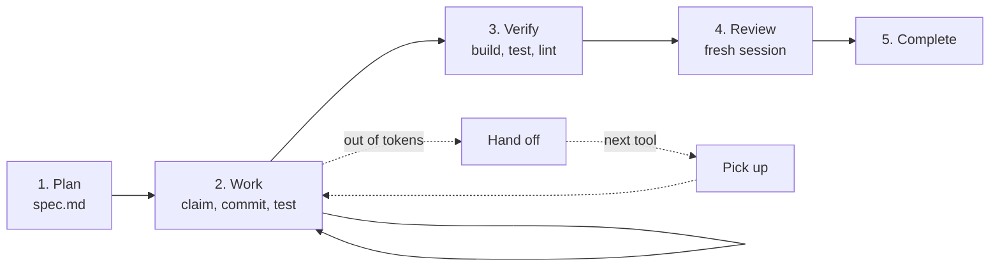

# The daily loop

Every change that deserves an increment goes through the same five steps. In a tool with SpecWeave skills you can say the words in the first column; everywhere else, or when you want control, run the commands.



| Step | Say | Command |
|---|---|---|
| Plan | "Let's add resumable checkout" | `specweave create-increment "Resumable checkout"` |
| Work | "Do the next task" | `specweave task next`, `task claim T-01`, `task done T-01 --run "npm test"` |
| Verify | "Verify it" | `specweave verify` |
| Review | "Review it" | the `review` skill, in a fresh session |
| Complete | "We're done" | `specweave complete 0042` |
| Hand off | "Hand off" | `specweave handoff --reason "out of tokens"` |
| Pick up | "Pick up where I left off" | `specweave pickup` |

## 1. Plan

Describe the outcome, not the implementation. The agent creates the increment and writes `spec.md`: the problem, the scope, numbered acceptance criteria, the approach and the tasks. Each task names the criteria it covers, the files it owns and the test that proves it.

Read the spec before any code is written. This is the cheapest moment to catch a misunderstanding. Change the criteria until they say exactly what done means.

If an open increment already owns the files this change touches, add criteria and tasks to that increment instead of opening another one. When you want to explore options before you open an increment, ask to brainstorm first. This step is optional: the `brainstorm` skill compares approaches and hands the chosen one to planning.

Small, self-contained fixes need no increment. Just ask your agent.

## 2. Work

```bash
specweave task next
```

prints the next open task with the text of its acceptance criteria, its files and its test. The agent claims it, edits only that task's files, commits as `0042: what changed`, and records completion with the real test run:

```bash
specweave task claim T-01
git commit -m "0042: save the checkout draft"
specweave task done T-01 --run "npm test -- draft"
```

`done` runs the command itself and only records the task when it exits 0, storing the output as evidence. If a task cannot be finished, `specweave task block T-01 --reason "..."` or `task skip` records why. You can watch progress with `specweave status` or the [dashboard](/docs/guides/dashboard).

To let the agent work through every task unattended, use [autonomous mode](/docs/guides/autonomous-execution). To split a large increment across several agents, use [agent teams](/docs/guides/agent-teams-and-swarms).

## 3. Verify

```bash
specweave verify
```

runs the build, test and lint commands from the Commands table in `AGENTS.md` and writes `reports/verify.md` and `reports/verify.json`, including which acceptance criteria the ledger shows as met.

## 4. Review

Ask for a review in a fresh session: a subagent, a new thread, or a different tool. The session that wrote the code should not approve it. The `review` skill reads the spec, the diff and the surrounding code, and reports only concrete problems with `path:line` for each, in `reports/review.md`.

A different model is a good reviewer. Hand off to Codex or Grok for the review, then hand back.

## 5. Complete

```bash
specweave complete 0042
```

closes the increment when the verify report passes. If you must close without a passing report, `--reason` records why in `metadata.json`. Completing never creates issues. It closes an issue that an earlier `specweave sync push` linked only when the close-on-complete setting is on, which `specweave sync setup` turns on. Push progress with `specweave sync push` when you want a tracker updated. See [GitHub](/docs/guides/github-sync).

## When you have to stop

Out of tokens, switching subscription, or want another model to take over: say "hand off", or run

```bash
specweave handoff --reason "out of tokens"
```

It releases your claims, records where you stopped, and pushes your branch and a snapshot of your uncommitted edits so a cloud session, another machine or another account can see them. In the next tool, say "pick up", or run `specweave pickup`: it fetches the handoff, applies your edits and prints the next task. Run `specweave auto-handoff on` once and Claude Code and Codex on your machine do the hand off themselves at 90% of the usage limit. Details in [Handoff and pickup](/docs/guides/cross-tool-handoff).

## Hotfixes

A production fix is still an increment, just a small one: `specweave create-increment "Fix double charge" --type hotfix`. Keep it to one or two tasks, verify, complete, and write a follow-up increment for the proper fix if the hotfix is a patch.
