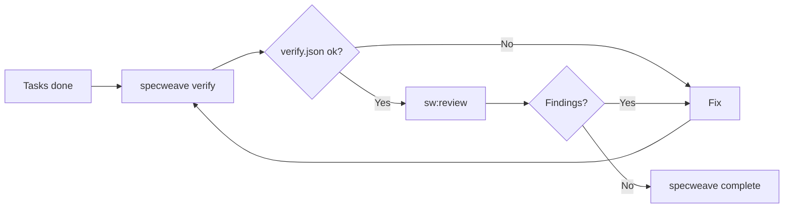

import CommandTabs from '@site/src/components/CommandTabs';

# Validation workflow

**Prove the code works before shipping — with one gate you can actually see.**

SpecWeave 1.x blocked closure on three generated reports (`grill-report.json`, `code-review-report.json`, `judge-llm-report.json`). In practice all three were present for 33% of closed increments; the rest were closed with `--force` or by hand-writing the files. 2.0 replaced them with a single gate: **`reports/verify.json` with `ok: true`.**

---

## The shape



---

## 1. Verify

```bash
specweave verify           # the active increment
specweave verify 0042      # a specific one
```

`verify` runs the project's verification commands **in order**, then writes `reports/verify.md` and `reports/verify.json`.

Which commands? `testing.commands[]` in `.specweave/config.json`:

```json
{
  "testing": {
    "commands": ["npm test", "npm run lint", "npm run build"]
  }
}
```

If that array is empty, SpecWeave auto-detects from the stack: `package.json` scripts (`test` → `lint` → `build`), Cargo, pytest, or go.

### What verify.json contains

| Field | Meaning |
|-------|---------|
| `ok` | Every command exited 0. **This is the closure gate.** |
| `ranAt` | ISO timestamp. |
| `commands[]` | `{ cmd, exit }` per command. |
| `acs` | `{ total, done }` from the `- [ ] AC-NN` checkboxes in `spec.md`. |
| `tasks` | `{ total, done, skipped, open }` from the ledger fold. |
| `skipped[]` | Every skipped task with its mandatory reason. |
| `ledgerMalformed` | Count of ledger lines that could not be parsed (BOM and CRLF are tolerated; this counts real junk). |

A failing command is not hidden: the tail of its output is stored, and `complete` will name it.

---

## 2. Review

<CommandTabs
  natural="Review this before I ship it"
  claude="sw:review 0042"
  other="specweave verify 0042 && read the diff yourself"
/>

`sw:review` is a **fresh-context adversarial pass** — the session that wrote the code never approves its own work. It reads the spec, the diff and the surrounding code and reports what is actually wrong. Every finding cites `path:line` and is re-verified before it is reported. `--full` fans the review out in parallel.

It writes `reports/review.md` and `reports/review.json`.

**Review never blocks.** `specweave complete` prints a one-line notice when `reports/review.md` is missing, and closes anyway. A gate that cannot be bypassed gets bypassed; a notice you can read gets read.

This one skill replaces 1.x's `grill`, `code-reviewer` and `judge-llm`.

---

## 3. Risk assessment (optional)

```bash
specweave qa 0042
```

Risk score and blockers. It is neither the review nor the gate — it is a second opinion on whether the increment is ready to be looked at.

---

## 4. Close

```bash
specweave complete 0042
```

The gate, in full:

| Condition | Result |
|-----------|--------|
| `reports/verify.json` missing | **Blocked** — run `specweave verify`, or pass `--reason "<why>"`. |
| `verify.json.ok` is false | **Blocked** — the failing commands are named. `--reason` overrides. |
| Tasks still open or claimed | Notice, not a block — they are listed. |
| `reports/review.md` missing | Notice: "consider running sw:review before shipping user-facing work". |

`--reason` is recorded in `metadata.json` as `closeReason`, so a deliberately un-verified closure leaves a trail instead of a lie.

Batch triage:

```bash
specweave complete --all --reason "closing stale spikes"
```

---

## Task-level verification

Validation is not only an end-of-increment event. Every `done` carries proof:

```bash
specweave task done T-03 --run "npm test -- cart"
```

The command runs through the OS shell (so Windows `.cmd` shims work), and the exit code plus the output tail are stored as the ledger event's evidence. **A failing command means the task does not close** (exit 5). You cannot mark a task done by asserting that it works.

A task that turns out to be unnecessary is closed honestly:

```bash
specweave task skip T-07 --reason "endpoint already exists in v2 API"
```

`skip` is terminal and the reason is mandatory — it shows up in `verify.json.skipped[]`.

---

## See also

- [SpecWeave 2.0](/docs/guides/specweave-2) — why the three-report pipeline went away
- [Skills reference](/docs/reference/skills) — `/sw:review`, `/sw:qa`, `/sw:done`
- [Configuration](/docs/reference/configuration) — `testing.commands`
