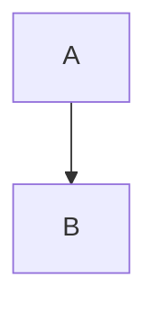

# Docusaurus Plugins

Custom plugins for SpecWeave documentation site.

## remark-mermaid-to-svg.js

**Purpose**: Automatically replace Mermaid code blocks with SVG images at build time.

### How It Works

1. **Build-time processing**: Runs as a Docusaurus remark plugin during markdown processing
2. **Finds mermaid blocks**: Scans for `\`\`\`mermaid` code blocks in markdown files
3. **Replaces with SVGs**: Swaps code blocks with `<ThemedImage>` components pointing to pre-generated SVGs
4. **Fallback**: If SVG not found, keeps original mermaid block for client-side rendering

### Configuration

Plugin is configured in `docusaurus.config.ts`:

```typescript
docs: {
  beforeDefaultRemarkPlugins: [
    require('./plugins/remark-mermaid-to-svg'),
  ],
}
```

### File Naming Convention

The plugin uses the same naming logic as `scripts/extract-and-generate-diagrams.sh`:

| Markdown File | Diagram # | SVG Name |
|--------------|-----------|----------|
| `introduction.md` | 1st diagram | `introduction.svg` |
| `introduction.md` | 2nd diagram | `introduction-2.svg` |
| `features.md` | 1st diagram | `features.svg` |

### Example

**Input** (`.specweave/docs/public/overview/introduction.md`):

````markdown
## Architecture


````

**Output** (generated HTML):

```jsx
<ThemedImage
  alt="introduction diagram"
  sources={{
    light: '/diagrams/introduction.svg',
    dark: '/diagrams/introduction-dark.svg',
  }}
/>
```

### Dependencies

- `unist-util-visit`: AST traversal (already installed via Docusaurus)
- SVG files must exist in `docs-site/static/diagrams/` (generated by `npm run generate:all-diagrams`)

### Debugging

If diagrams aren't showing:

1. **Check SVG files exist**:
   ```bash
   ls -la docs-site/static/diagrams/
   ```

2. **Regenerate diagrams**:
   ```bash
   npm run generate:all-diagrams
   ```

3. **Check console warnings**:
   ```
   ⚠️  SVG not found for {diagram-name}, using client-side rendering
   ```

4. **Verify build output**:
   ```bash
   npm run build
   # Check: docs-site/build/diagrams/
   ```

### Maintenance

No maintenance needed! The plugin automatically:
- Detects diagram naming conflicts (same file, multiple diagrams)
- Handles missing SVGs gracefully
- Supports both light and dark themes
- Works with any number of diagrams per file

---

**Related Documentation**:
- [Diagram SVG Generation Guide](../../.specweave/docs/internal/delivery/guides/diagram-svg-generation.md)
- [Diagram Conventions](../../.specweave/docs/internal/delivery/guides/diagram-conventions.md)
