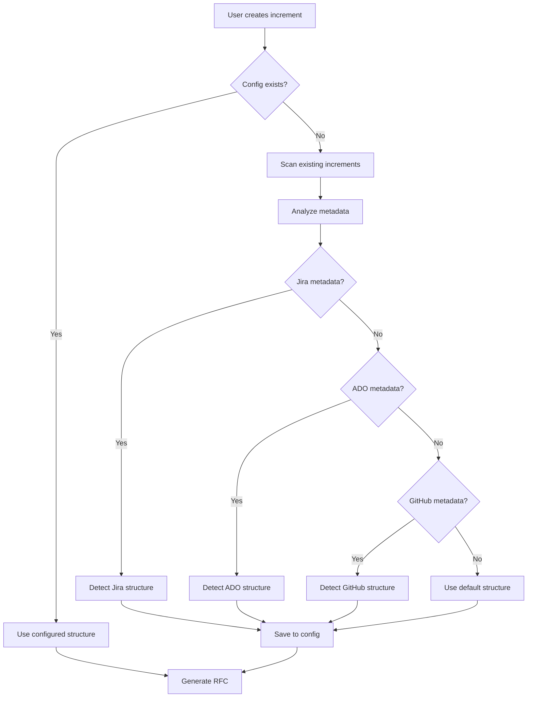
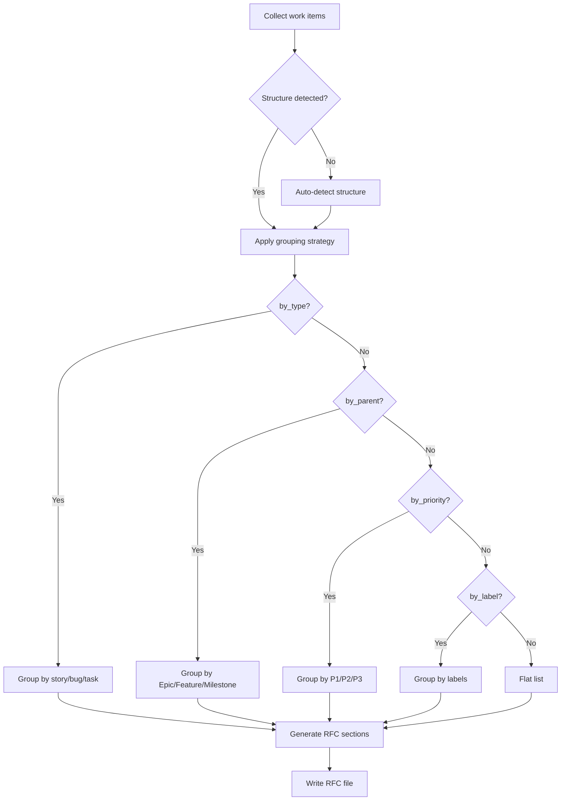

# 🎯 Flexible Project Structure System - Design Document

**Date**: October 28, 2025
**Status**: 📋 **DESIGN DOCUMENT** (Planned Feature)

---

## 🏆 Vision

This document describes a **planned feature** for SpecWeave to automatically adapt to different project management structures:
- Jira (Epic → Story → Sub-task)
- Azure DevOps (Feature → User Story → Task)
- GitHub (Milestone → Issue or flat Issues)
- Custom hierarchies

### Goal

**Current**: Uses `RFCGenerator` with fixed story/bug/task types (Jira-focused)
**Planned**: Flexible system that detects and adapts to ANY project hierarchy

---

## 📦 Planned Components

### 1. Project Structure Detector (`src/core/project-structure-detector.ts`)

**Purpose**: Automatically detect project management structure

**Planned Features**:
- 🎯 Auto-detect from existing increments
- 🎯 Analyze work items and metadata
- 🎯 Support 4 hierarchy levels (flat, single_parent, two_level, three_level)
- 🎯 Provide confidence scores and evidence
- 🎯 Save detected structure to config for reuse

**Detection Logic**:
```typescript
// Analyzes existing increments
const detected = await detector.autoDetectStructure();

console.log(detected);
// {
//   structure: {
//     source: 'jira',
//     hierarchyLevel: 'two_level',
//     workItemTypes: { parentLevel: 'Epic', itemLevel: 'Story', ... },
//     groupingStrategy: 'by_type'
//   },
//   confidence: 0.8,
//   evidence: ['Found Jira metadata', 'Detected Epic links', ...],
//   sampleIncrements: ['0001', '0002', '0003']
// }
```

### 2. Flexible RFC Generator (Future Enhancement)

**Purpose**: Generate RFCs that adapt to detected project structure

**Planned Features** (to enhance existing `RFCGenerator`):
- 🎯 Support flexible work items (not just story/bug/task)
- 🎯 Multiple grouping strategies (by_type, by_parent, by_priority, by_label, flat, custom)
- 🎯 Adapt header metadata (Epic, Feature, Milestone, etc.)
- 🎯 Handle parent relationships dynamically
- 🎯 Support custom grouping functions

**Current State**: Using `src/core/rfc-generator.ts` with fixed story/bug/task types

**Grouping Strategies**:

1. **by_type** - Groups by work item type (story, bug, task, issue, feature, etc.)
2. **by_parent** - Groups by parent (Epic, Feature, Milestone)
3. **by_priority** - Groups by priority (P1, P2, P3)
4. **by_label** - Groups by labels/tags (GitHub-style)
5. **flat** - No grouping, flat list
6. **custom** - User-defined grouping function

### 3. Configuration System (`.specweave/config.example.yaml`)

**Purpose**: Allow manual override of auto-detected structure

**7 Configuration Examples Provided**:

```yaml
# Example 1: Standard Jira
project_structure:
  source: jira
  hierarchy_level: two_level
  work_item_types:
    parent_level: Epic
    item_level: Story
    sub_item_level: Sub-task
  grouping_strategy: by_type

# Example 2: GitHub with Milestones
project_structure:
  source: github
  hierarchy_level: single_parent
  work_item_types:
    parent_level: Milestone
    item_level: Issue
  grouping_strategy: by_parent

# Example 3: Flat GitHub Issues
project_structure:
  source: github
  hierarchy_level: flat
  work_item_types:
    item_level: Issue
  grouping_strategy: by_label

# Example 4: ADO without Features
project_structure:
  source: ado
  hierarchy_level: single_parent
  work_item_types:
    item_level: User Story
    sub_item_level: Task
  grouping_strategy: by_type

# Example 5: Enterprise Jira (3-level)
project_structure:
  source: jira
  hierarchy_level: three_level
  work_item_types:
    top_level: Initiative
    parent_level: Epic
    item_level: Story
    sub_item_level: Sub-task
  grouping_strategy: by_parent

# Example 6: ADO with Epic → Feature → Story
project_structure:
  source: ado
  hierarchy_level: three_level
  work_item_types:
    top_level: Epic
    parent_level: Feature
    item_level: User Story
    sub_item_level: Task
  grouping_strategy: by_type

# Example 7: Custom Manual Structure
project_structure:
  source: manual
  hierarchy_level: two_level
  work_item_types:
    parent_level: Module
    item_level: Requirement
    sub_item_level: Implementation Task
  grouping_strategy: by_parent
```

### 4. Comprehensive Documentation (`docs/integrations/PROJECT_STRUCTURE_GUIDE.md`)

**40+ page design guide** covering:
- 📋 All 4 hierarchy levels explained
- 📋 5 grouping strategies with examples
- 📋 Auto-detection process concept
- 📋 Manual configuration approach
- 📋 RFC adaptation examples (Jira, GitHub, ADO)
- 📋 Migration guide
- 📋 API usage examples
- 📋 Best practices
- 📋 Troubleshooting

---

## 🎯 Supported Project Structures

### Level 0: Flat (No Hierarchy)

**Example**: GitHub Issues without Milestones
```
Issue #1: Add login
Issue #2: Fix bug
Issue #3: Setup CI/CD
```

**RFC Groups**: By type or by label
```markdown
## Bug Fixes
- Fix dashboard bug (#2)

## Features
- Add login (#1)

## Infrastructure
- Setup CI/CD (#3)
```

---

### Level 1: Single Parent

**Example**: GitHub with Milestones
```
Milestone: v1.0 Release
├── Issue #1: Add login
├── Issue #2: Add registration
└── Issue #3: Setup analytics
```

**RFC Groups**: By Milestone or by type
```markdown
## Milestone: v1.0 Release

### Features
- Add login (#1)
- Add registration (#2)

### Infrastructure
- Setup analytics (#3)
```

---

### Level 2: Two-Level (Standard)

**Example Jira**: Epic → Story → Sub-task
```
Epic: User Authentication
├── Story: User can login
│   └── Sub-task: Create login form
└── Story: User can register
    └── Sub-task: Setup email verification
```

**Example ADO**: Feature → User Story → Task
```
Feature: User Authentication
├── User Story: Login functionality
│   └── Task: Frontend login form
└── User Story: Registration flow
    └── Task: Email service
```

**RFC Groups**: By type (stories, bugs, tasks)
```markdown
## User Stories

### 1. User can login
**Jira**: [SCRUM-1](https://...)

### 2. User can register
**Jira**: [SCRUM-2](https://...)

## Technical Tasks
- Create login form
- Setup email verification
```

---

### Level 3: Three-Level (Enterprise)

**Example**: Initiative → Epic → Feature → Story
```
Initiative: Digital Transformation
└── Epic: User Management
    ├── Feature: Authentication
    │   └── Story: Login with SSO
    └── Feature: Authorization
        └── Story: Role-based access
```

**RFC Groups**: By Epic or Feature
```markdown
## Epic: User Management

### Feature: Authentication
#### Story: Login with SSO

### Feature: Authorization
#### Story: Role-based access
```

---

## 🔄 How It Works

### 1. Auto-Detection Flow



### 2. RFC Generation Flow



---

## 🧪 Examples of Generated RFCs

### Jira Project with Epic

**Input**: Epic SCRUM-2 with 3 stories

**Generated RFC**:
```markdown
# RFC 0003: User Authentication

**Status**: Draft
**Created**: 2025-10-28
**Jira Epic**: [SCRUM-2](https://jira.example.com/browse/SCRUM-2)

## Summary
Implement user authentication with login and registration.

## Motivation
Users need to securely access the system.

## Detailed Design

### User Stories

#### 1. User can login
As a user, I want to login so that I can access my account.
**Jira**: [SCRUM-3](https://...)

#### 2. User can register
As a user, I want to register so that I can create an account.
**Jira**: [SCRUM-4](https://...)

### Bug Fixes

#### 1. Fix OAuth redirect
OAuth provider redirects to wrong URL.
**Priority**: P1 | **Jira**: [SCRUM-5](https://...)
```

### GitHub Project with Milestone

**Input**: Milestone "v1.0" with 5 issues

**Generated RFC**:
```markdown
# RFC 0004: v1.0 Release

**Status**: Draft
**Created**: 2025-10-28
**Milestone**: [v1.0 Release](https://github.com/org/repo/milestone/1)
**Repository**: org/repo

## Summary
Core features for initial launch.

## Motivation
Launch MVP with essential functionality.

## Detailed Design

### Milestone: v1.0 Release

#### 1. Add user authentication
Implement login and registration.
**GitHub**: [#123](https://github.com/org/repo/issues/123)
**Labels**: feature, frontend

#### 2. Setup CI/CD pipeline
Automated testing and deployment.
**GitHub**: [#124](https://github.com/org/repo/issues/124)
**Labels**: infrastructure, devops
```

### ADO Project with Feature

**Input**: Feature "Payment System"

**Generated RFC**:
```markdown
# RFC 0005: Payment System

**Status**: Draft
**Created**: 2025-10-28
**ADO Feature**: [#12345](https://dev.azure.com/org/project/_workitems/edit/12345)

## Summary
Implement payment processing with Stripe.

## Motivation
Users need to make purchases.

## Detailed Design

### User Stories

#### 1. User can add payment method
Users can save credit cards for future purchases.
**ADO**: [#12346](https://...)

#### 2. User can checkout
Users can complete purchase with saved payment.
**ADO**: [#12347](https://...)

### Technical Tasks

#### 1. Integrate Stripe SDK
Setup Stripe SDK and webhooks.
**ADO**: [#12348](https://...)
```

---

## 📊 Configuration Detection Evidence

When SpecWeave detects your structure, it provides evidence:

```json
{
  "structure": {
    "source": "jira",
    "hierarchyLevel": "two_level",
    "workItemTypes": {
      "parentLevel": "Epic",
      "itemLevel": "Story",
      "subItemLevel": "Sub-task"
    },
    "groupingStrategy": "by_type"
  },
  "confidence": 0.8,
  "evidence": [
    "Found Jira metadata in increment 0003",
    "Found Epic link: SCRUM-2",
    "Detected 2-level hierarchy with Epics",
    "Work item types seen: story, bug, task",
    "Analyzed 5 increments"
  ],
  "sampleIncrements": ["0001", "0002", "0003", "0004", "0005"]
}
```

---

## 🚀 Integration with Existing Code

### JiraIncrementalMapper Integration

The existing Jira mapper can be updated to use the flexible system:

```typescript
// OLD: Hard-coded types
const stories: RFCWorkItem[] = [...];
const bugs: RFCWorkItem[] = [...];
const tasks: RFCWorkItem[] = [...];

// NEW: Flexible work items
const workItems: FlexibleWorkItem[] = [
  {
    type: 'story',
    id: 'US0003-001',
    title: 'User can login',
    parent: {
      type: 'Epic',
      key: 'SCRUM-2',
      title: 'User Authentication'
    },
    // ... other fields
  }
];

// Future: Flexible RFC generator adapts automatically
// const rfcGenerator = new FlexibleRFCGenerator();
// await rfcGenerator.generateRFC({
//   metadata: { ... },
//   workItems  // Auto-groups based on detected structure
// });

// Current: Use existing RFCGenerator
const rfcGenerator = new RFCGenerator();
await rfcGenerator.generateRFC({
  metadata: { ... },
  stories,
  bugs,
  tasks
});
```

---

## 🔧 Next Steps for ADO & GitHub Sync

The flexible system is ready for you to implement ADO and GitHub sync:

### ADO Example

```typescript
const workItems: FlexibleWorkItem[] = adoWorkItems.map(item => ({
  type: item.fields['System.WorkItemType'].toLowerCase(),  // 'user story', 'task', 'bug'
  id: `WI${item.id}`,
  title: item.fields['System.Title'],
  description: item.fields['System.Description'],
  priority: mapAdoPriority(item.fields['Microsoft.VSTS.Common.Priority']),
  source_key: item.id.toString(),
  source_url: `https://dev.azure.com/${org}/${project}/_workitems/edit/${item.id}`,
  parent: item.fields['System.Parent'] ? {
    type: 'Feature',  // Auto-detected from structure
    key: item.fields['System.Parent'].toString(),
    title: 'Parent Feature Name'
  } : undefined,
  labels: item.fields['System.Tags']?.split(';') || []
}));

// RFC automatically adapts to ADO structure!
await rfcGenerator.generateRFC({
  metadata: {
    incrementId: '0006',
    title: 'New Feature',
    status: 'draft',
    source: 'ado',
    created: new Date().toISOString().split('T')[0]
  },
  sourceMetadata: {
    source_type: 'ado',
    parent_type: 'Feature',
    parent_key: '12345',
    parent_url: 'https://dev.azure.com/...',
    project: 'MyProject'
  },
  summary: 'Feature description',
  motivation: 'Why we need this',
  workItems
});
```

### GitHub Example

```typescript
const workItems: FlexibleWorkItem[] = githubIssues.map(issue => ({
  type: issue.pull_request ? 'pull request' : 'issue',
  id: `#${issue.number}`,
  title: issue.title,
  description: issue.body,
  source_key: `#${issue.number}`,
  source_url: issue.html_url,
  parent: issue.milestone ? {
    type: 'Milestone',
    key: issue.milestone.number.toString(),
    title: issue.milestone.title,
    url: issue.milestone.html_url
  } : undefined,
  labels: issue.labels.map(l => l.name)
}));

// RFC automatically adapts to GitHub structure!
await rfcGenerator.generateRFC({
  metadata: {
    incrementId: '0007',
    title: issue.milestone?.title || 'Development',
    status: 'draft',
    source: 'github',
    created: new Date().toISOString().split('T')[0]
  },
  sourceMetadata: {
    source_type: 'github',
    parent_type: 'Milestone',
    parent_key: issue.milestone?.number.toString(),
    parent_url: issue.milestone?.html_url,
    repository: 'org/repo'
  },
  summary: `Milestone: ${issue.milestone?.title}`,
  motivation: issue.milestone?.description || 'GitHub milestone',
  workItems
});
```

---

## 🧪 Implementation Status

**Current State**: Design document only

**Next Steps**:
- 🎯 Implement ProjectStructureDetector
- 🎯 Enhance RFCGenerator with flexible grouping
- 🎯 Add configuration system
- 🎯 Build ADO and GitHub adapters
- 🎯 Add comprehensive testing

---

## 📚 Documentation Files

| File | Purpose |
|------|---------|
| **PROJECT_STRUCTURE_GUIDE.md** | Complete guide for flexible structure (40+ pages) |
| **FLEXIBLE_STRUCTURE_SUMMARY.md** | This file - design document |
| **.specweave/config.example.yaml** | Configuration examples (7 scenarios) |
| **src/core/project-structure-detector.ts** | (Planned) Auto-detection implementation |
| **src/core/rfc-generator.ts** | Current RFC generator (Jira-focused) |

---

## 🎉 Summary

This design document outlines a **planned flexible structure system** for SpecWeave:

🎯 **Auto-detect** from existing increments
🎯 **Adapt RFCs** to your hierarchy
🎯 **Flexible grouping** (type, parent, priority, label, flat, custom)
🎯 **Manual override** via config.yaml
📋 **7 configuration examples** designed
📋 **Comprehensive documentation** (40+ pages)
🎯 **Backward compatible** with existing increments
🎯 **Enable ADO & GitHub** sync implementation

**Current State**: Using `RFCGenerator` with Jira-focused structure. This design provides a roadmap for multi-system support.

---

**Made with ❤️ by SpecWeave** | Design Document | October 28, 2025
