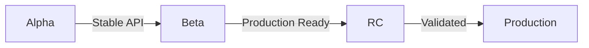

# SpecWeave Release Management Plugin

**Comprehensive release management for single-repo, multi-repo, and monorepo architectures.**

## Overview

The **specweave-release** plugin provides end-to-end release management capabilities including:

- **Release Strategy Design** - Analyze architecture and recommend optimal versioning approach
- **Version Alignment** - Coordinate versions across multiple repositories
- **RC Workflows** - Manage release candidates from creation to production promotion
- **Multi-Repo Coordination** - Orchestrate complex releases across dozens of services
- **Brownfield Detection** - Automatically detect and document existing release patterns
- **Living Documentation** - Maintain release strategy and version matrices

## Components

### Skills (4 total)

| Skill | Purpose | When to Use |
|-------|---------|-------------|
| **release-strategy-advisor** | Analyze architecture and recommend release strategy | "What release strategy should we use?" |
| **release-coordinator** | Coordinate multi-repo releases with dependency management | "Coordinate release across 5 microservices" |
| **version-aligner** | Align versions across repos using semantic versioning | "Align versions before release" |
| **rc-manager** | Manage release candidate lifecycle and testing | "Create RC for v2.0.0" |

### Agents (1 total)

| Agent | Purpose | Tools |
|-------|---------|-------|
| **release-manager** | Master orchestrator for all release activities | Read, Write, Edit, Bash, Glob, Grep |

### Commands (4+ total)

| Command | Purpose |
|---------|---------|
| `/specweave-release:init` | Initialize or analyze release strategy |
| `/specweave-release:align` | Align versions across repositories |
| `/specweave-release:rc` | Manage release candidates |
| `/specweave-release:coordinate` | Plan coordinated multi-repo releases |
| `/specweave-release:publish` | Execute releases (single or multi-repo) |
| `/specweave-release:rollback` | Rollback failed releases |
| `/specweave-release:matrix` | Show/update version matrix |

## Installation

**Automatic** (via SpecWeave init):
```bash
# Already installed if you ran specweave init
npx specweave init .
```

**Manual** (if needed):
```bash
/plugin install specweave-release
```

## Quick Start

### Greenfield Project (New Release Strategy)

```bash
# 1. Initialize release strategy
/specweave-release:init

# Answer questions:
# - How many repositories? [3]
# - Team structure? [One team]
# - Deployment frequency? [Weekly]
# - Coupling? [Moderate]

# → Creates: .specweave/docs/internal/delivery/release-strategy.md
# → Recommends: Umbrella versioning strategy

# 2. Create first release
/specweave:increment "0001-v1-0-0-release"

# 3. Align versions
/specweave-release:align

# 4. Create RC
/specweave-release:rc create 1.0.0

# 5. Test and promote
/specweave-release:rc promote 1.0.0-rc.3
```

### Brownfield Project (Existing Release Process)

```bash
# 1. Analyze existing release patterns
/specweave-release:init

# → Detects:
#   - Git tags (v1.0.0, v1.1.0, ...)
#   - CI/CD (.github/workflows/release.yml)
#   - Monorepo tools (Lerna, Nx)
#   - Current strategy (independent versioning)

# → Creates: .specweave/docs/internal/delivery/release-strategy.md
# → Documents: Existing process + recommendations

# 2. Start using SpecWeave for next release
/specweave:increment "0010-v2-0-0-release"
/specweave-release:align
/specweave-release:rc create 2.0.0
```

## Use Cases

### Single-Repo Release

**Scenario**: NPM package with semantic versioning

```bash
# Current: v1.5.0
# Goal: Release v2.0.0 (breaking changes)

# 1. Initialize strategy (if not done)
/specweave-release:init

# 2. Create release increment
/specweave:increment "0050-v2-release"

# 3. Align version (analyze commits → suggest v2.0.0)
/specweave-release:align

# 4. Create RC
/specweave-release:rc create 2.0.0
# → v2.0.0-rc.1 → staging → testing

# 5. Iterate if needed
# Fix bugs → /specweave-release:rc iterate 2.0.0-rc.1
# → v2.0.0-rc.2

# 6. Promote to production
/specweave-release:rc promote 2.0.0-rc.3
# → v2.0.0 → gradual rollout
```

### Multi-Repo Coordinated Release

**Scenario**: 5 microservices with umbrella versioning

```bash
# Repos:
# - frontend v4.2.0
# - backend v2.8.0
# - api-gateway v3.1.0
# - auth-service v2.0.0
# - shared-lib v1.5.0

# Goal: Product v5.0.0 (breaking changes in 3 services)

# 1. Create product release increment
/specweave:increment "0060-product-v5-release"

# 2. Analyze and align versions
/specweave-release:align
# → Suggests:
#   frontend: v5.0.0 (breaking)
#   backend: v2.9.0 (feature)
#   api-gateway: v4.0.0 (breaking)
#   auth-service: v2.0.0 (no change)
#   shared-lib: v2.0.0 (breaking)

# 3. Create coordinated RC
/specweave-release:rc create-multi product-v5.0.0
# → Tags all repos with rc.1

# 4. Test cross-service
# → Staging deployment (all services)
# → E2E tests (cross-service flows)

# 5. Promote when ready
/specweave-release:rc promote-multi product-v5.0.0-rc.2
# → Wave-by-wave deployment
# → Updates version matrix
```

### Monorepo Release (Lerna/Nx)

**Scenario**: Lerna monorepo with 12 packages (independent versioning)

```bash
# Current: 12 packages with different versions

# 1. Initialize strategy (detects Lerna)
/specweave-release:init
# → Detects: Lerna independent mode
# → Documents: Current approach

# 2. Align versions (only changed packages)
/specweave-release:align
# → Analyzes commits per package
# → Suggests bumps for changed packages only
# → Validates inter-package dependencies

# 3. Execute release
# → Integration with Lerna: lerna publish
# → Or manual: npm version + npm publish per package
```

## Release Strategies

### Lockstep Versioning

**Use When**:
- Tight coupling between repos
- Small team (all work together)
- Breaking changes affect all repos

**How It Works**:
```yaml
All repos share same version:
  frontend: v3.0.0
  backend: v3.0.0
  api: v3.0.0

Bump together:
  Breaking change in any repo → All bump to v4.0.0
```

### Independent Versioning

**Use When**:
- Loose coupling between repos
- Large team (autonomous squads)
- Frequent releases (daily/weekly)

**How It Works**:
```yaml
Each repo has own version:
  frontend: v5.0.0
  backend: v2.9.0
  api: v4.0.0

Bump independently:
  frontend breaking → v6.0.0
  backend feature → v2.10.0
  api unchanged → v4.0.0
```

### Umbrella Versioning

**Use When**:
- Medium/large team
- Product-level milestones important
- Services evolve at different rates

**How It Works**:
```yaml
Product version + service versions:
  Product v5.0.0:
    frontend: v5.0.0
    backend: v2.9.0
    api: v4.0.0

Version matrix tracks combinations
```

## Release Candidate Workflow

**Three-Stage Pre-Release**:



**Alpha** (Early Development):
- Tag: v1.0.0-alpha.1, v1.0.0-alpha.2
- Audience: Internal developers
- Stability: Unstable (breaking changes OK)
- Duration: Weeks to months

**Beta** (Feature Complete):
- Tag: v1.0.0-beta.1, v1.0.0-beta.2
- Audience: Beta testers, QA team
- Stability: Mostly stable
- Duration: 2-6 weeks

**RC** (Production Ready):
- Tag: v1.0.0-rc.1, v1.0.0-rc.2
- Audience: Pre-production, canary users
- Stability: Production-ready
- Duration: 1-2 weeks

**Production**:
- Tag: v1.0.0 (final)
- Audience: All users
- Stability: Stable

## Living Documentation

**Release Strategy Document**:
```
.specweave/docs/internal/delivery/release-strategy.md
```

**Contains**:
- Repository overview
- Versioning strategy (lockstep/independent/umbrella)
- RC workflow
- CI/CD integration
- Changelog management
- Hotfix strategy
- Release checklist
- DORA metrics
- Decision history

**Version Matrix** (Umbrella Releases):
```
.specweave/docs/internal/delivery/version-matrix.md
```

**Contains**:
- Product version history
- Service version mappings
- Compatibility matrix
- Breaking changes per release

## Integration with Brownfield Analyzer

**Automatic Release Pattern Detection**:

When brownfield-analyzer skill runs, it:
1. Detects repository structure
2. Scans git tags for version patterns
3. Analyzes CI/CD configurations
4. Checks package manager files
5. Identifies monorepo tools

Then invokes release-strategy-advisor to:
- Classify release strategy
- Document in living docs
- Suggest improvements

**Example Output**:
```markdown
## Detected Release Strategy

Type: Monorepo with independent versioning

Evidence:
  - lerna.json found (12 packages)
  - Independent mode enabled
  - Git tags: 145 total (per-package versioning)
  - CI/CD: GitHub Actions + semantic-release
  - Frequency: Weekly

Recommendations:
  ✓ Current strategy is solid
  → Consider: Umbrella versioning for product milestones
  → Add: Version matrix documentation
```

## Best Practices

**Version Discipline**:
- Always follow semantic versioning
- Never skip version numbers
- Use pre-release tags for testing
- Document breaking changes clearly

**Release Safety**:
- Always use RC for major versions
- Gradual rollout (canary → 10% → 25% → 50% → 100%)
- Monitor for 1+ hour at each stage
- Have rollback plan ready

**Documentation**:
- Update living docs after every release
- Maintain version matrix for umbrella releases
- Document lessons learned
- Link to ADRs for major decisions

**Testing**:
- Run ALL tests before releasing
- Validate cross-repo compatibility
- Load test at 150% expected capacity
- Security scan for every release

## Configuration

**In `.specweave/config.json`**:

```json
{
  "release": {
    "strategy": "independent",
    "rcRequired": ["major"],
    "gradualRollout": {
      "canary": 0.05,
      "wave1": 0.10,
      "wave2": 0.25,
      "wave3": 0.50,
      "wave4": 1.00
    },
    "monitoring": {
      "errorRateThreshold": 0.05,
      "latencyThreshold": 2.0
    }
  }
}
```

## Advanced Topics

### Coordinated RC Across Repos

```bash
# Tag all repos with same RC iteration
/specweave-release:rc create-multi product-v3.0.0

# Creates:
# - frontend: v5.0.0-rc.1
# - backend: v3.0.0-rc.1
# - api-gateway: v4.0.0-rc.1

# Test cross-service compatibility
# Deploy all to staging
# Run E2E tests

# Found bugs → iterate
/specweave-release:rc iterate-multi product-v3.0.0-rc.1

# Creates:
# - frontend: v5.0.0-rc.2 (bug fixed)
# - api-gateway: v4.0.0-rc.2 (bug fixed)
# - backend: v3.0.0-rc.1 (unchanged)

# All pass → promote
/specweave-release:rc promote-multi product-v3.0.0-rc.2
```

### Hotfix Workflow

```bash
# Production: v2.0.0
# Critical bug discovered

# 1. Create hotfix branch from tag
git checkout -b hotfix/v2.0.1 v2.0.0

# 2. Fix bug
# ... make changes ...

# 3. Fast-track testing
npm test  # Critical tests only

# 4. Release hotfix
git tag v2.0.1
git push origin v2.0.1

# 5. Merge back to main
git checkout main
git merge hotfix/v2.0.1
```

## Troubleshooting

**Issue**: Version conflicts detected
```bash
# Solution: Update dependencies to compatible versions
# Then retry alignment
```

**Issue**: RC testing failed
```bash
# Solution: Fix issues, iterate to next RC
/specweave-release:rc iterate 1.0.0-rc.1
```

**Issue**: Canary deployment showing errors
```bash
# Solution: Rollback immediately
/specweave-release:rc rollback 1.0.0-rc.3
```

## Examples

See `/examples` directory for:
- Single-repo release workflow
- Multi-repo coordinated release
- Monorepo (Lerna) release
- RC workflow with testing
- Version matrix for umbrella releases

## Related Documentation

- **SpecWeave Core**: Main framework documentation
- **Living Docs**: `.specweave/docs/internal/delivery/`
- **ADRs**: Architecture decision records
- **Release Strategy**: Project-specific strategy docs

## Support

- **Issues**: https://github.com/anton-abyzov/specweave/issues
- **Discussions**: https://github.com/anton-abyzov/specweave/discussions
- **Website**: https://spec-weave.com

---

**Version**: 1.0.0
**Author**: Anton Abyzov
**License**: MIT
