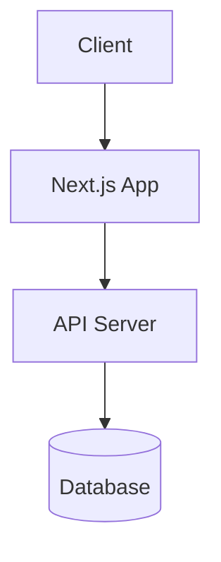

# ADR 0001: [Decision Title]

**Status**: draft | review | approved | deprecated
**Author**: [Your Name]
**Created**: YYYY-MM-DD
**Last Updated**: YYYY-MM-DD
**Reviewers**: @architect, @tech-lead

---

## Status

**Current**: draft | review | approved | deprecated

**If deprecated**:
- **Superseded by**: [Link to new ADR]
- **Reason**: Why this decision was changed

## Context

**What's the situation?**

Describe the context and background:
- What problem are we solving?
- What constraints exist?
- What are the requirements?
- Who are the stakeholders?

## Decision

**What did we decide?**

Clearly state the decision made:
- What are we doing?
- How are we implementing it?
- What technology/approach are we using?

**Example**:
> We will use **Next.js** as our frontend framework for the web application.

### Architecture Diagram (Optional)

**Diagram File**: `0001-{decision-title}.context.mmd` (co-located with this file)

If the decision involves architecture changes, include a diagram:

**See**: [Diagram Conventions](../delivery/guides/diagram-conventions-comprehensive.md) for best practices.

## Consequences

**What's the impact?**

### Positive Consequences ✅
- **Pro 1**: Benefit of this decision
- **Pro 2**: Benefit of this decision
- **Pro 3**: Benefit of this decision

### Negative Consequences ❌
- **Con 1**: Drawback of this decision
- **Con 2**: Drawback of this decision
- **Con 3**: Drawback of this decision

### Neutral Consequences
- **Impact 1**: Neither positive nor negative
- **Impact 2**: Neither positive nor negative

## Alternatives Considered

**What else did we consider?**

### Alternative 1: [Name]
- **Description**: What is it?
- **Pros**: Benefits
- **Cons**: Drawbacks
- **Why not chosen**: Reason we didn't select this

### Alternative 2: [Name]
- **Description**: What is it?
- **Pros**: Benefits
- **Cons**: Drawbacks
- **Why not chosen**: Reason we didn't select this

### Alternative 3: [Name]
- **Description**: What is it?
- **Pros**: Benefits
- **Cons**: Drawbacks
- **Why not chosen**: Reason we didn't select this

## References

**Related documentation and resources**

- [PRD: Product Requirements](../../strategy/prd-{feature}.md)
- [HLD: System Design](../hld-{system}.md)
- [RFC: API Design](../rfc/0001-{feature}.md)
- External resources: Links to articles, documentation, etc.

## Notes

**Additional context**

- Discussion notes
- Meeting decisions
- Future considerations

---

**Approval**:
- [ ] Architect: @name
- [ ] Tech Lead: @name
- [ ] Security (if applicable): @name
