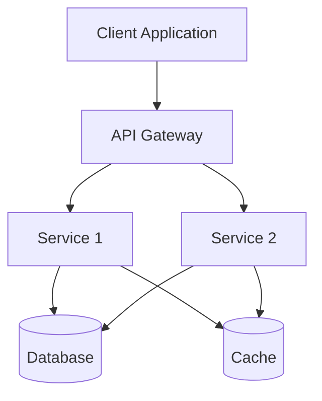
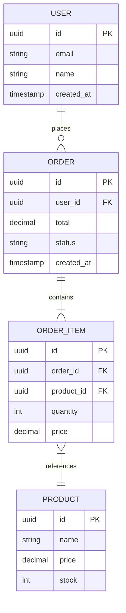

# HLD: [System Name]

**Status**: draft | review | approved | deprecated
**Author**: [Your Name]
**Created**: YYYY-MM-DD
**Last Updated**: YYYY-MM-DD
**Reviewers**: @architect, @tech-lead

---

## Context

**Why does this system exist?**

Link to the business requirements and explain the context:
- **PRD**: [Link to PRD](../strategy/prd-{feature}.md)
- **Business Problem**: What are we solving?
- **Goals**: What are we trying to achieve?

## Requirements (Functional / Non-functional)

### Functional Requirements
- **FR1**: Feature requirement 1
- **FR2**: Feature requirement 2
- **FR3**: Feature requirement 3

### Non-Functional Requirements
- **Performance**: <XXms latency, XX req/sec throughput
- **Scalability**: Support XX concurrent users
- **Availability**: XX% uptime (SLO)
- **Reliability**: < XX errors per million requests
- **Security**: Authentication, authorization, encryption
- **Compliance**: GDPR, HIPAA, SOC 2, etc.

## Architecture Overview (diagram)

**High-level component diagram**

**Diagram File**: `hld-{system-name}.context.mmd` (co-located with this file)

**Component Description**:
- **Client Application**: Web/mobile app
- **API Gateway**: Entry point, authentication, rate limiting
- **Service 1**: Core business logic
- **Service 2**: Secondary service
- **Database**: PostgreSQL, primary data store
- **Cache**: Redis, caching layer

**Related Diagrams**:
- `hld-{system-name}.context.mmd` - System context (this diagram)
- `hld-{system-name}.sequence-auth.mmd` - Authentication flow
- `hld-{system-name}.entity.mmd` - Data model

**See**: [Diagram Conventions](../../docs/DIAGRAM-CONVENTIONS.md) for best practices.

## Data Model

**Entities and relationships**

**Schema Details**:
- **Users**: User accounts, authentication
- **Orders**: Purchase orders
- **Order Items**: Line items in orders
- **Products**: Product catalog

## Integrations

**External systems and APIs**

### External Services
- **Stripe**: Payment processing
  - **Integration**: REST API
  - **Authentication**: API key
  - **Data Shared**: Payment details, customer info

- **SendGrid**: Email delivery
  - **Integration**: REST API
  - **Authentication**: API key
  - **Data Shared**: Email addresses, templates

### Internal Services
- **Auth Service**: Authentication/authorization
- **Notification Service**: Email, SMS, push notifications

## Security & Privacy

### Authentication
- **Method**: OAuth 2.0, JWT tokens
- **MFA**: Optional multi-factor authentication
- **Session Management**: 24-hour token expiry

### Authorization
- **Model**: Role-Based Access Control (RBAC)
- **Roles**: Admin, User, Guest
- **Permissions**: Resource-level permissions

### Data Encryption
- **In Transit**: TLS 1.3
- **At Rest**: AES-256 encryption
- **Secrets Management**: HashiCorp Vault / AWS Secrets Manager

### Compliance
- **GDPR**: User data deletion, consent management
- **HIPAA**: (if applicable) PHI handling
- **SOC 2**: Access controls, audit logging

## Scaling & Capacity

### Performance Targets
- **Latency**: p95 < 200ms, p99 < 500ms
- **Throughput**: 1000 req/sec
- **Concurrent Users**: 10,000

### Scaling Strategy
- **Horizontal Scaling**: Auto-scaling groups
- **Database**: Read replicas, connection pooling
- **Caching**: Redis for frequently accessed data
- **CDN**: CloudFlare for static assets

### Capacity Planning
- **Current**: XXX users, XXX req/sec
- **6 months**: XXX users, XXX req/sec
- **12 months**: XXX users, XXX req/sec

## Trade-offs

**Design compromises and rationale**

### Trade-off 1: [Decision]
- **Choice**: What we chose
- **Alternative**: What we didn't choose
- **Reason**: Why we made this choice
- **Impact**: Consequences

### Trade-off 2: [Decision]
- **Choice**: What we chose
- **Alternative**: What we didn't choose
- **Reason**: Why we made this choice
- **Impact**: Consequences

## Open Questions

**Unresolved issues**

- [ ] **Q1**: Question about X?
  - **Owner**: @name
  - **Due Date**: YYYY-MM-DD

- [ ] **Q2**: Question about Y?
  - **Owner**: @name
  - **Due Date**: YYYY-MM-DD

## Related Documentation

- [PRD: Product Requirements](../strategy/prd-{feature}.md)
- [ADR: Architecture Decisions](adr/)
- [RFC: API Specifications](rfc/)
- [Runbook: Operations](../operations/runbook-{service}.md)

---

**Approval**:
- [ ] Architect: @name
- [ ] Tech Lead: @name
- [ ] Security: @name
