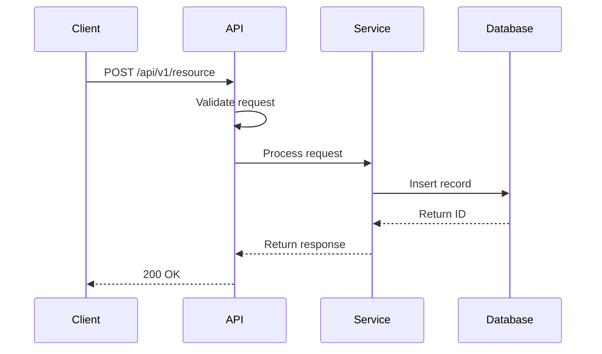

# SPEC 0001: [Feature Title]

**Status**: draft | review | approved | deprecated
**Author**: [Your Name]
**Created**: YYYY-MM-DD
**Last Updated**: YYYY-MM-DD
**Reviewers**: @architect, @tech-lead, @security

---

## Summary

**One-sentence description**

[Brief description of what this spec proposes]

## Motivation

**Why is this needed?**

Explain the problem and why this specification is necessary:
- What problem does this solve?
- What user needs does it address?
- What business value does it provide?

**Link to PRD**: [PRD: Feature Name](../../strategy/prd-{feature}.md)

## Proposal (API / Schema / Flow)

**What are we proposing?**

### API Design

**Endpoint**: `POST /api/v1/{resource}`

**Request**:
```json
{
  "field1": "value",
  "field2": 123,
  "field3": {
    "nested": "object"
  }
}
```

**Response**:
```json
{
  "id": "uuid",
  "field1": "value",
  "field2": 123,
  "created_at": "2025-01-01T00:00:00Z"
}
```

**Status Codes**:
- `200 OK`: Success
- `400 Bad Request`: Invalid input
- `401 Unauthorized`: Not authenticated
- `403 Forbidden`: Not authorized
- `500 Internal Server Error`: Server error

### Data Schema

**Database Schema**:
```sql
CREATE TABLE resource (
    id UUID PRIMARY KEY DEFAULT gen_random_uuid(),
    field1 VARCHAR(255) NOT NULL,
    field2 INTEGER NOT NULL,
    created_at TIMESTAMP NOT NULL DEFAULT NOW(),
    updated_at TIMESTAMP NOT NULL DEFAULT NOW()
);
```

### Flow Diagram

**Process Flow**:


## Backwards Compatibility

**Breaking changes?**

- [ ] **No breaking changes** - Fully backwards compatible
- [ ] **Breaking changes** - Describe impact:
  - Change 1: Impact and migration plan
  - Change 2: Impact and migration plan

**Migration Strategy**:
- How will existing clients be migrated?
- What is the deprecation timeline?
- Are there versioned endpoints?

## Rollout Plan

**How to deploy?**

### Phase 1: Development
- [ ] Implement feature
- [ ] Write unit tests
- [ ] Write integration tests

### Phase 2: Testing
- [ ] Deploy to staging
- [ ] QA testing
- [ ] Performance testing
- [ ] Security testing

### Phase 3: Production Rollout
- [ ] Deploy to production
- [ ] Feature flag (if applicable): `feature_{name}_enabled`
- [ ] Gradual rollout: 5% → 25% → 50% → 100%
- [ ] Monitor metrics

### Rollback Plan
- How to rollback if issues occur?
- What are the rollback criteria?

## Observability & SLO Impact

**Monitoring and performance**

### Metrics
- **Latency**: p95 < XXms, p99 < XXms
- **Throughput**: XX req/sec
- **Error Rate**: < X%
- **Availability**: XX% uptime

### Logging
- Log all requests/responses (excluding sensitive data)
- Log errors with stack traces
- Log performance metrics

### Alerting
- Alert if latency > XXms
- Alert if error rate > X%
- Alert if availability < XX%

### Dashboards
- Create Grafana dashboard for this feature
- Link: [Dashboard URL]

## Security / Compliance Considerations

**Risks and mitigations**

### Security
- **Authentication**: How is the API authenticated?
- **Authorization**: Who can access this API?
- **Input Validation**: How is input validated?
- **Data Encryption**: Is data encrypted in transit/at rest?
- **Rate Limiting**: What are the rate limits?

### Compliance
- **GDPR**: Does this handle PII? How is data deleted?
- **HIPAA**: (if applicable) Does this handle PHI?
- **SOC 2**: Are access controls in place?

### Threat Model
- **Threat 1**: Description
  - **Mitigation**: How we address it
- **Threat 2**: Description
  - **Mitigation**: How we address it

## Alternatives

**Other approaches considered**

### Alternative 1: [Name]
- **Description**: What is it?
- **Pros**: Benefits
- **Cons**: Drawbacks
- **Why not chosen**: Reason

### Alternative 2: [Name]
- **Description**: What is it?
- **Pros**: Benefits
- **Cons**: Drawbacks
- **Why not chosen**: Reason

## Decision & Next Steps

**Outcome and action items**

### Decision
- [ ] **Approved** - Proceed with implementation
- [ ] **Rejected** - Do not proceed
- [ ] **Deferred** - Revisit later

### Next Steps
- [ ] Create implementation tasks
- [ ] Assign owners
- [ ] Set timeline
- [ ] Update roadmap

### Action Items
- [ ] **Task 1**: Description - Owner: @name - Due: YYYY-MM-DD
- [ ] **Task 2**: Description - Owner: @name - Due: YYYY-MM-DD

## Related Documentation

- [PRD: Product Requirements](../../strategy/prd-{feature}.md)
- [HLD: System Design](../hld-{system}.md)
- [ADR: Architecture Decisions](../adr/)
- [Runbook: Operations](../../operations/runbook-{service}.md)

---

**Approval**:
- [ ] Architect: @name
- [ ] Tech Lead: @name
- [ ] Security: @name
- [ ] Product Owner: @name
